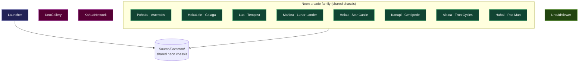
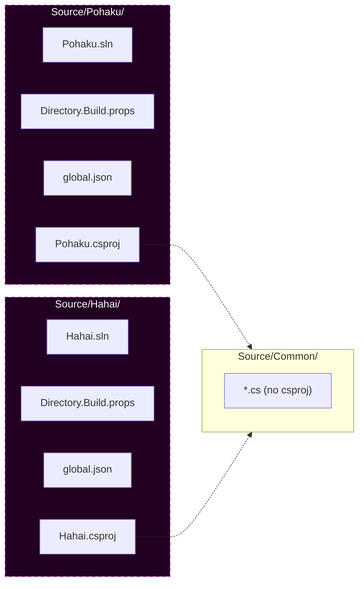

# 01 – Overview

## What this repo is

UnoSkiaDemos is a consolidated home for ten neon-style arcade-game homages plus two special-purpose demos, all built on [Uno Platform](https://platform.uno) + [SkiaSharp](https://github.com/mono/SkiaSharp). The games target both `net10.0-desktop` (Windows) and `net10.0-browserwasm` (browser) from the same source. The neon-arcade games are intentionally homages — recognizable mechanics, restyled visuals — and most are Hawaiian-named after the original game they reference.

## The demo catalog



| Category | Demos | Notes |
|---|---|---|
| Kitchen-sink | UnoGallery, KahuaNetwork | Largest demos; full scene pipelines. UnoGallery has 30 tiles + SKSL post-FX + EXIF loader + mic-reactive ambient; KahuaNetwork is the holographic 3D city with data-stream particles. |
| Neon arcade family | Pohaku, HokuLele, Lua, Mahina, Heiau, Kanapi, Alaloa, Hahai | Eight homages sharing the `Source/Common/` chassis. Each is a single .csproj with a `Game/` folder following the same conventions. |
| Shell | Launcher | The catalog landing page that the wasm site is built around. Lists every demo and click-launches each one. Uses the chassis. |
| Special-purpose | Uno3dViewer | OpenGL 3D viewer via Silk.NET + Assimp. Desktop-only (uses `GLCanvasElement`, not `SKCanvasElement`). Doesn't share the chassis. |

## Hawaiian naming

The arcade-family game names are Hawaiian words chosen for their fit with the original game's defining mechanic:

| Demo | Hawaiian meaning | Original arcade game | Why it fits |
|---|---|---|---|
| Pohaku | stone | Asteroids | The rocks you shoot. |
| HokuLele | shooting stars | Galaga | Star-formation diving attackers. |
| Lua | pit / well | Tempest | The 3D well you walk the rim of. |
| Mahina | moon | Lunar Lander | The moon you're landing on. |
| Heiau | sacred stone temple | Star Castle | The fortress at the center. |
| Kanapi | centipede | Centipede | Literal translation. |
| Alaloa | long path / trail | Tron Cycles | The glowing trail every cycle drags. |
| Hahai | to chase / pursue | Pac-Man | The maze chase. |

## Per-demo isolation

Every demo is fully self-contained under `Source/<Demo>/`:

- Its own `.sln`, `.csproj`, `Directory.Build.props`, `Directory.Packages.props`, `global.json`.
- No shared MSBuild root targets that would cascade across demos.
- No aggregator solution at the repo root.
- Different SkiaSharp versions per demo are explicitly allowed. KahuaNetwork pins SkiaSharp 3.119.4; everything else runs 4.151.0. UnoGallery keeps a `$(SkiaSharpVersion)` switch so either line can be built on demand — that per-demo freedom is what made re-testing a SkiaSharp 4 native crash a one-command job when the fix landed.



The shared chassis under `Source/Common/` is **source-included** into each demo's csproj via a `<Compile>` glob — not referenced as a project. This means:

- Each demo compiles its own copy of the chassis under its own SkiaSharp / Uno SDK pins. Two demos can use different SkiaSharp versions without runtime conflict.
- There's no `Common.csproj` to maintain; the chassis is a collection of `.cs` files.
- Per-demo `#if HAS_NAUDIO` / `#if __WASM__` conditional compilation works the same way for chassis code as for demo-local code.

See [03 – Shared Chassis](03-Shared-Chassis.md) for the mechanism in detail.

## Build infrastructure

```
Builds/
├── Build-All.ps1               ← aggregator (loops the per-demo Build- scripts)
├── Build-<Demo>.ps1            ← one per demo
├── Run-<Demo>.ps1              ← one per demo
└── Publish-Site.ps1            ← bundles launcher + all wasm games into publish/site/
```

All `Build-` / `Run-` scripts accept `-Configuration <Debug|Release>` and `-Wasm`. `Build-All -Wasm` skips Uno3dViewer (no browserwasm TFM). `Publish-Site.ps1` is desktop-irrelevant — it always builds wasm.

See [06 – Build and Deploy](06-Build-And-Deploy.md) for the full pipeline.

## What's NOT here

- No mobile (iOS / Android) — every csproj targets `net10.0-desktop` and `net10.0-browserwasm` only (except UnoGallery which has the full Uno target matrix; it's the kitchen-sink demo).
- No multiplayer — every game is single-player against AI bots, with attract-mode autopilot demos.
- No save state beyond a per-demo high score in `%LocalAppData%\<Demo>\` (desktop only).
- No live tiles, no toasts, no notifications — these are pure Skia canvases.
