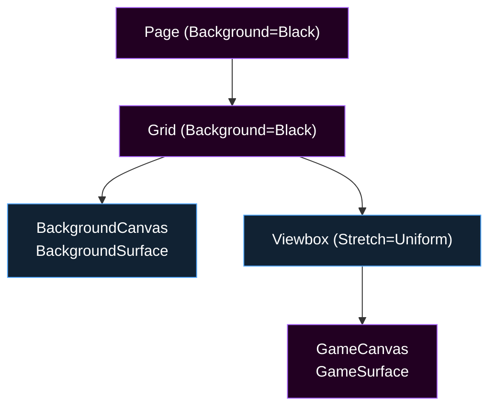
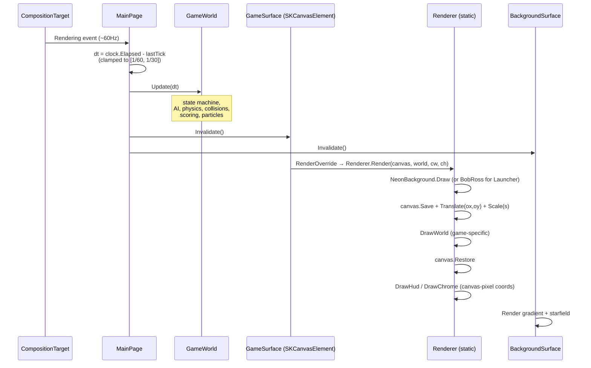
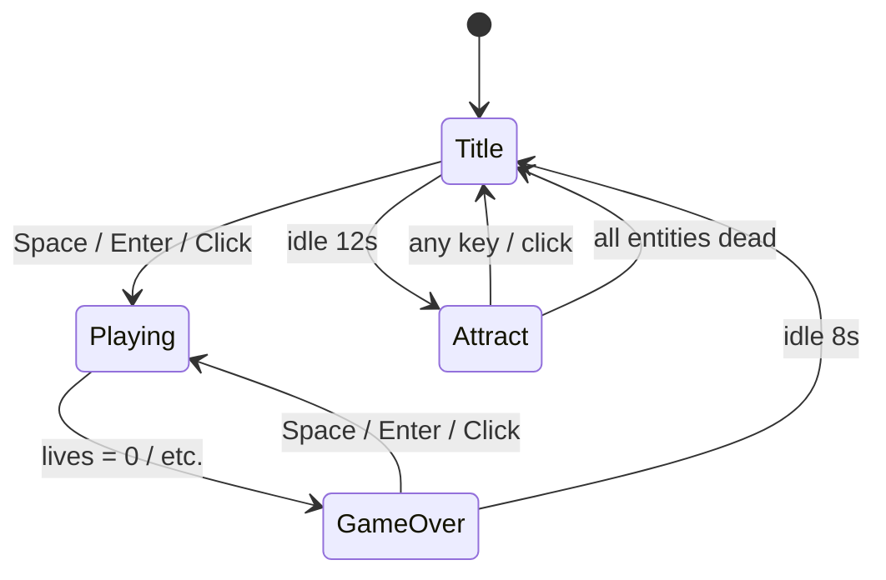
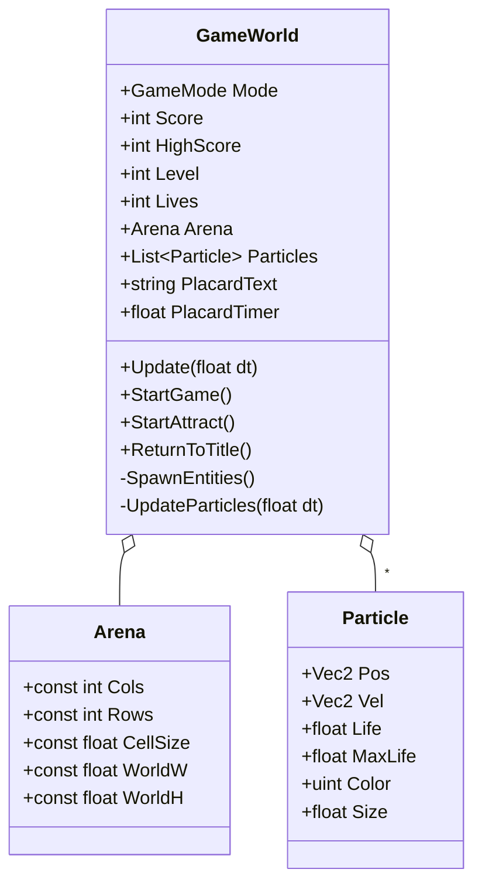

# 02 – Demo Anatomy

Every arcade-family demo (Pohaku, HokuLele, Lua, Mahina, Heiau, Kanapi, Alaloa, Hahai) follows the same structural shape, plus the Launcher uses a stripped-down variant. This doc explains that shape so you can read any single demo and predict where each piece lives.

## File layout

```
Source/<Demo>/
├── <Demo>.sln                             ← per-demo solution
├── Directory.Build.props
├── Directory.Build.targets
├── Directory.Packages.props
├── global.json                            ← pins Uno SDK + .NET SDK
└── <Demo>/                                ← the actual project folder
    ├── <Demo>.csproj                      ← UnoFeatures, SkiaSharp pin, audio.js include, NAudio conditional
    ├── App.xaml + .xaml.cs                ← Uno boilerplate; sets window size; calls AudioEngine.Init()
    ├── MainPage.xaml + .xaml.cs           ← input + render-loop driver, Viewbox layout
    ├── BackgroundSurface.cs               ← thin wrapper around Arcade.Common.AmbientStarBackdrop
    ├── GameSurface.cs                     ← thin SKCanvasElement that forwards to Renderer.Render
    ├── GlobalUsings.cs                    ← global usings for Arcade.Common.*
    ├── Game/
    │   ├── Arena.cs                       ← grid / playfield helpers (game-specific)
    │   ├── Entities.cs                    ← model types, enums (GameMode, Direction, etc.)
    │   ├── GameWorld.cs                   ← state machine + Update(dt); the per-frame brain
    │   ├── Renderer.cs                    ← static Render(canvas, world, w, h) — all draws
    │   └── AudioEngine.cs                 ← per-game voice definitions + facade
    ├── Assets/
    │   ├── Icons/icon.svg
    │   ├── Icons/icon_foreground.svg
    │   └── Splash/splash_screen.svg       ← UnoSplashScreen Color="#050014" to match neon backdrop
    ├── Platforms/
    │   ├── Desktop/Program.cs
    │   └── WebAssembly/
    │       ├── Program.cs
    │       ├── manifest.webmanifest
    │       ├── WasmCSS/Fonts.css
    │       ├── WasmScripts/AppManifest.js
    │       └── WasmScripts/audio.js       ← Web Audio mirror of AudioEngine voices
    ├── Properties/PublishProfiles/*.pubxml
    └── Strings/en/Resources.resw
```

Demos that don't render any audio (Launcher) omit the `audio.js` and its `<EmbeddedResource>` entry.

## Three-layer XAML page

Every demo's `MainPage.xaml` follows the same three-layer composition:



1. **`<local:BackgroundSurface>` — the ambient layer.** Fills the whole window with the deep-space gradient + drifting parallax starfield, regardless of how letterboxed the playfield ends up. `IsHitTestVisible="False"` so pointer events fall through to the playfield. Inherits `Arcade.Common.AmbientStarBackdrop`.
2. **`<Viewbox Stretch="Uniform">` — the letterbox.** Constrains the playfield to a fixed aspect (square for most games, portrait for HokuLele/Lua, custom for Hahai). The Viewbox does all the scale + center math; the renderer just draws into a known world-coordinate range.
3. **`<local:GameSurface>` — the playfield.** A `SKCanvasElement` sized to the world's natural dimensions (e.g., `Width="720" Height="720"` for square games). Its `RenderOverride` delegates to the demo's static `Renderer.Render(canvas, world, cw, ch)`.

The reason for the third layer being inside a Viewbox: it gives us pixel-clean scaling for free. The renderer always thinks in world coords (e.g., 0..720 × 0..720); the Viewbox scales the canvas to fit the window. Side bars / letterboxing reveal the BackgroundSurface beneath.

## The per-frame render loop



Key points:

- Update is decoupled from draw: `GameWorld.Update(dt)` is called once per frame on the UI thread by `MainPage.OnRendering`; `RenderOverride` then reads world state and draws. Even though both happen in the same UI tick, the separation makes attract-mode bots, deterministic stepping, and unit testability easier.
- `dt` is clamped: spikes above 1/30s (e.g., a debugger pause) get capped so physics stays stable; impossibly small values (≤ 0, which happens on the first tick) get a 1/60s default.
- Both canvases invalidate every frame. The background starfield needs continuous updates to drift; the playfield needs them to animate game state.

## The canonical game-state machine

All arcade-family games (and Launcher's catalog idle behavior) use the same four-state machine:



| State | Purpose | Input handling |
|---|---|---|
| `Title` | Title screen with controls + "PRESS SPACE TO START". Renders ambient/idle animation. | Space/Enter/Click → Playing. Idle 12s → Attract. |
| `Playing` | Active gameplay. Reads player input. | All game keys; Esc to title (some demos). |
| `Attract` | A demo loop with a bot autopiloting the game. Score still ticks but is reset on key press. | Any key → Title. |
| `GameOver` | "GAME OVER" overlay with final score + "PRESS SPACE TO PLAY AGAIN". | Space/Enter/Click → Playing. Idle `GameOverIdleSeconds` (8s) → Title, so an unattended cabinet cycles back into Attract instead of parking here. |

**The cycle has to close.** `GameOver → Title` was optional for a long time, and only Paku implemented
it — so every other demo sat on the GAME OVER panel indefinitely, because the `Title → Attract` idle
timer only advances on the Title screen. Attract mode was unreachable after a death until someone
pressed a key. Every demo now idles out of `GameOver` after `GameOverIdleSeconds`; end to end that is
8s to Title plus 12s to Attract. (Paku keeps its own 3s `GameOverDelay` straight to Attract — its
Attract *is* its title screen.)

`GameWorld.Mode` holds the current state; `GameWorld.Update(dt)` switches on it and runs the appropriate physics. Mode transitions go through helper methods like `StartGame()`, `StartAttract()`, `ReturnToTitle()`, `GoToGameOver()` so they can do the right side effects (reset entities, save high score, etc.).

## The standard `GameWorld` shape

Game state held by every demo's `GameWorld.cs`:



Specifics differ per game (Hahai has a Pac + Ghosts[], Alaloa has Cycles[], Mahina has a Lander, etc.), but the surface — `Mode`, `Score`, `HighScore`, `Lives`, `Update(dt)`, the `StartGame`/`StartAttract`/`ReturnToTitle` triplet, and a particles list — is consistent.

## Adding a new arcade-family demo

The fastest way to start a new demo is to copy an existing one (Alaloa is a clean recent example) and rename. The mechanical steps:

1. Copy `Source/Alaloa/` to `Source/<NewDemo>/`, rename folder + csproj + sln + namespace inside the .cs/.xaml files (`Alaloa` → `<NewDemo>` throughout).
2. Update `<ApplicationTitle>`, `<ApplicationId>`, `<ApplicationPublisher>`, `<Description>` in the csproj.
3. Update `globalThis.alaloaAudio` → `globalThis.<newdemo>Audio` in the audio.js + AudioEngine.cs.
4. Replace the `Game/` content with the new game's logic.
5. Add `Builds/Build-<NewDemo>.ps1` + `Run-<NewDemo>.ps1`, append to `Build-All.ps1` `$scripts`.
6. ~~Add an entry to [`Source/Launcher/Launcher/Game/GameCatalog.cs`](../../Source/Launcher/Launcher/Game/GameCatalog.cs) so the launcher includes it.~~ **Reversed — skip this step.** Extra cards broke the launcher's grid layout, so the catalog stays at its original eight entries and new games ship standalone. See [08 – Chassis Extensions § What was deliberately not built](08-Chassis-Extensions.md#what-was-deliberately-not-built).
7. Append the slug to `$games` in [`Builds/Publish-Site.ps1`](../../Builds/Publish-Site.ps1).
8. Add `Docs/<NewDemo>/README.md` matching the per-game pattern.

See also [01 – Overview § Per-demo isolation](01-Overview.md#per-demo-isolation) for the boundaries.
