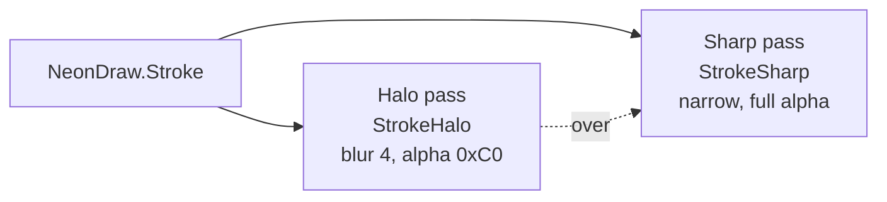
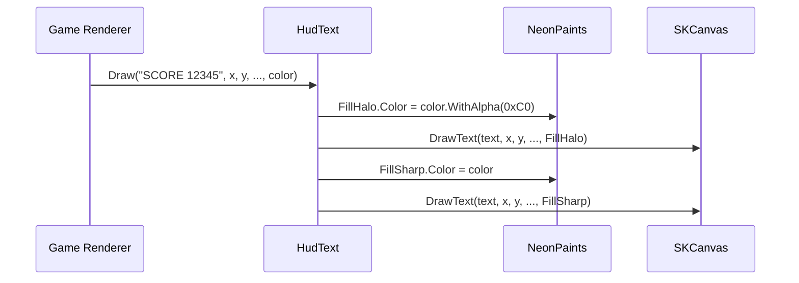
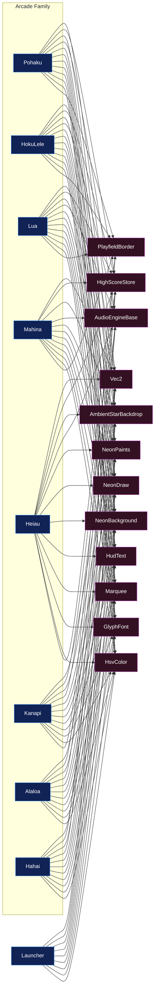

# 03 – Shared Chassis

`Source/Common/` is the shared "neon arcade chassis" — a collection of static helpers and abstract base classes that every arcade-family demo (and the Launcher) source-includes via a `<Compile>` glob. This doc explains the mechanism, each chassis component's role, and how they compose into a single demo.

## Layout

```
Source/Common/
├── Vec2.cs                                ← 2D float vector struct
├── HighScoreStore.cs                      ← per-demo high-score persistence
├── AmbientStarBackdrop.cs                 ← SKCanvasElement base for BackgroundSurface
├── Audio/
│   └── AudioEngineBase.cs                 ← NAudio mixer + JS-interop bridge
└── Chassis/
    ├── HsvColor.cs                        ← HSV→RGB for hue cycling
    ├── NeonPaints.cs                      ← static SKPaint pool (halo/sharp)
    ├── NeonDraw.cs                        ← line / stroke / circle helpers
    ├── NeonBackground.cs                  ← deep-space gradient
    ├── PlayfieldBorder.cs                 ← thin neon rectangle around the playfield
    ├── HudText.cs                         ← text rendering with halo + sharp passes
    ├── GlyphFont.cs                       ← hand-drawn vector glyph font (A-Y + - + ' · 4)
    └── Marquee.cs                         ← perspective-tilted scrolling marquee + rainbow title
```

## Source-include mechanism

Every consuming csproj contains this `<ItemGroup>`:

```xml
<ItemGroup>
  <Compile Include="..\..\Common\**\*.cs" Link="Common\%(RecursiveDir)%(Filename)%(Extension)" />
</ItemGroup>
```

What this does:

- The `Include` glob pulls every `.cs` file under `Source/Common/` into the demo's compilation as if those files lived under the demo's own folder.
- `Link=` controls how the files appear in IDE solution trees — they show up under a virtual `Common\...` folder so they're navigable but visually distinct from demo-local files.
- The chassis is **not** a separate assembly — it compiles once per demo, alongside that demo's own code.

### Why source-include instead of a project reference

A `Common.csproj` ProjectReference would be more conventional but loses the things that matter here:

| Concern | Source-include outcome | ProjectReference outcome |
|---|---|---|
| Per-demo SkiaSharp version pin | Each demo's compile of chassis uses that demo's SkiaSharp version. Pohaku on Skia 4 preview and KahuaNetwork on Skia 3 stable can both consume chassis pieces (if applicable) without conflict. | Common.csproj pins ONE SkiaSharp version, forcing every consumer onto it. |
| `#if HAS_NAUDIO` / `#if __WASM__` | Chassis files participate in each demo's conditional-compilation context. `AudioEngineBase.cs` references NAudio inside `#if HAS_NAUDIO` and the conditional matches the consumer's DefineConstants. | Common.csproj defines its own constants — every consumer that needs `HAS_NAUDIO` for chassis behavior has to match exactly, and you can't have one consumer with NAudio and another without. |
| MSBuild SDK pin | Each demo can pin its own `Uno.Sdk` version (`global.json` per demo). | Common.csproj also pins an SDK — version skew breaks builds. |
| Per-demo isolation | Each demo remains a fully self-contained unit; deleting Source/Common/ only breaks chassis-using demos. | Common.csproj becomes a maintenance dependency every demo must track. |

The downside is no binary reuse — every demo recompiles the chassis. With 8 chassis-using demos at ~1500 lines of chassis code, that's irrelevant for build time.

## Chassis component reference

### `Vec2`

Plain `struct Vec2 { public float X, Y; }` with the usual arithmetic operators. Used as the universal 2D-position type across all entities in all games (`Pos`, `Vel`, etc.). Kept as a struct (not a class) so positions live on the stack / inside arrays without GC pressure.

### `HighScoreStore`

Per-demo high-score persistence to `%LocalAppData%\<DemoName>\highscore.txt` on desktop. Fail-silent — if the directory can't be created or the file can't be read/written, the call is a no-op. WASM has no persistence (returns 0 / no-ops on save) — the chassis is intentionally opinionated that high scores are a desktop-only courtesy, not a load-bearing feature.

```csharp
static readonly HighScoreStore HighScoreStore = new("Alaloa");
HighScore = HighScoreStore.Load();
// ... on death:
if (newScore > HighScore) { HighScore = newScore; HighScoreStore.Save(HighScore); }
```

### `AmbientStarBackdrop`

Abstract `SKCanvasElement` subclass that renders a deep-space gradient + 110 drifting twinkling stars in three parallax layers. Each demo declares a thin sealed wrapper in its own namespace:

```csharp
namespace Pohaku;
public sealed class BackgroundSurface : Arcade.Common.AmbientStarBackdrop { }
```

The wrapper exists so the page can reference `<local:BackgroundSurface>` from XAML. All actual rendering logic stays in the base.

Background gradient colors are virtual properties (`BgTop` / `BgBottom`) — a demo can override them by giving its `BackgroundSurface` wrapper non-default values.

### `Audio/AudioEngineBase`

Abstract base that handles cross-platform audio plumbing:

- **Desktop (`HAS_NAUDIO`)** — owns a single `WaveOutEvent` + `MixingSampleProvider` with 60ms desired latency. `TryPlay(ISampleProvider)` adds a voice to the mixer.
- **WASM (`__WASM__`)** — `WasmPlay(string js)` calls `Uno.Foundation.WebAssemblyRuntime.InvokeJS()` to invoke a function on `globalThis.<demo>Audio`.
- **Other TFMs** — every method is a no-op.

Each demo declares its own concrete `AudioEngine` static class with per-voice methods that delegate to the base. See [05 – Audio](05-Audio.md).

### `Chassis/HsvColor`

Standard HSV→RGB conversion (`HsvToRgb(h, s, v) → SKColor`). Used by `Marquee.DrawRainbowTitle` and the hue-cycling effects in title screens / scrolling text.

### `Chassis/NeonPaints`

The static SKPaint pool that drives every neon-styled draw in the chassis. Six paints, configured once at startup, with `Color` mutated per-draw:

| Paint | Style | Use |
|---|---|---|
| `MarqueeHalo` | Stroke 11px + blur 7 | Glow pass for marquee + title glyphs |
| `MarqueeSharp` | Stroke 4px | Crisp pass for marquee + title glyphs |
| `StrokeHalo` | Stroke 5.5px + blur 4 | Glow pass for arbitrary paths (NeonDraw.Stroke / Line) |
| `StrokeSharp` | Stroke 2.0px | Crisp pass for arbitrary paths |
| `FillHalo` | Fill + blur 5 | Glow pass for filled shapes (NeonDraw.CircleFill, HudText.Draw) |
| `FillSharp` | Fill | Crisp pass for filled shapes |

`StrokeHalo` and `StrokeSharp` have constants `DefaultStrokeHaloWidth` / `DefaultStrokeSharpWidth` — helpers that change widths (e.g., `NeonDraw.Line` with custom widths) MUST restore them before returning, or downstream calls inherit the wrong widths.

### `Chassis/NeonDraw`

Convenience helpers that paint with the halo+sharp double-pass technique. Three calls cover most needs:

```csharp
NeonDraw.Stroke(canvas, path, color);                  // generic SKPath
NeonDraw.Line(canvas, x1, y1, x2, y2, color);          // a line
NeonDraw.CircleFill(canvas, cx, cy, r, color);         // filled neon disc
```

Each draws a low-alpha large-stroke halo first, then a full-alpha narrow stroke on top — the visual signature of the chassis.



### `Chassis/NeonBackground`

`Draw(canvas, cw, ch)` paints the deep-space vertical gradient (`#050014` → `#180236`) that every demo's playfield starts with. The same gradient colors are used by `AmbientStarBackdrop` so the side bars and playfield share a base palette.

### `Chassis/PlayfieldBorder`

`Draw(canvas, w, h, color)` paints a thin neon rectangle around the playfield. Used by most arcade demos to frame the world; some demos (Hahai's maze, Alaloa's grid) skip it because the playfield is visually self-contained.

### `Chassis/HudText`

`Draw(canvas, text, x, y, align, font, color)` — text rendering with the halo+sharp double-pass. The HUD scoreboards, placards, title text, and game-over panels in every demo go through this helper.



### `Chassis/GlyphFont`

A hand-drawn 5×7-ish vector font implemented as `Dictionary<char, SKPath>`. Used by Marquee (the scrolling text + rainbow title) — NOT used for SKFont-rendered text like score, which goes through Consolas via HudText.

Currently defined glyphs: `A-N` (no J), `O-W` (no Q, X), `Y` (no Z), digit `4`, plus `·`, `-`, `+`, `'`. Missing glyphs render as gaps. Add new glyphs by extending the dictionary with a coordinate list (the `G(...)` helper turns line-segment pairs into an SKPath).

### `Chassis/Marquee`

Two static methods:

- `Draw(canvas, text, cw, ch, …)` — perspective-tilted scrolling marquee that slides right-to-left along the bottom of the screen. The forward tilt is a manual perspective matrix; the text scrolls in a loop based on `Stopwatch.Elapsed`. Each glyph cycles through HSV hue independent of the others.
- `DrawRainbowTitle(canvas, title, cw, yTop)` — big centered title rendered in GlyphFont with hue-cycling color per character. Used on every demo's title screen.

Both pull glyphs from `GlyphFont` and paint with `NeonPaints.MarqueeHalo` + `MarqueeSharp`.

## Chassis-by-demo usage matrix



Launcher uses every chassis piece except `AudioEngineBase` (silent by design) and `HighScoreStore` (no game state to persist). Alaloa and Hahai skip `PlayfieldBorder` because their grids already frame themselves.
