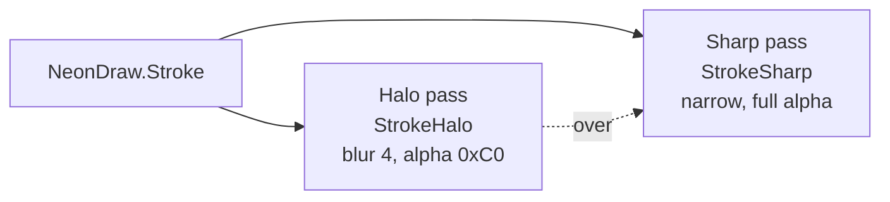
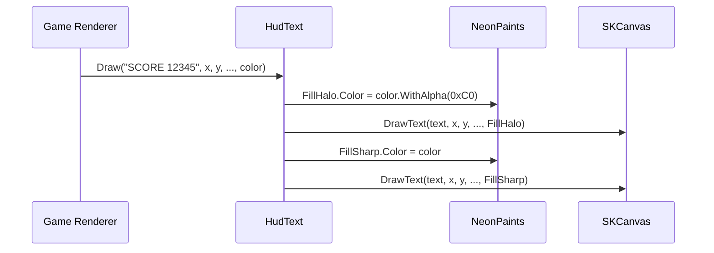
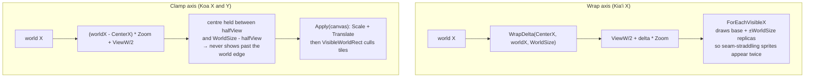

# 03 – Shared Chassis

`Source/Common/` is the shared "neon arcade chassis" — a collection of static helpers and abstract base classes that every arcade-family demo (and the Launcher) source-includes via a `<Compile>` glob. This doc explains the mechanism, each chassis component's role, and how they compose into a single demo.

## Layout

```
Source/Common/
├── Vec2.cs                                ← 2D float vector struct
├── HighScoreStore.cs                      ← per-demo high-score persistence
├── AmbientStarBackdrop.cs                 ← SKCanvasElement base for BackgroundSurface
├── Audio/
│   └── AudioEngineBase.cs                 ← NAudio mixer + JS-interop bridge
└── Chassis/
    ├── HsvColor.cs                        ← HSV→RGB for hue cycling
    ├── NeonPaints.cs                      ← static SKPaint pool (halo/sharp)
    ├── NeonDraw.cs                        ← line / stroke / circle helpers
    ├── NeonBackground.cs                  ← deep-space gradient
    ├── PlayfieldBorder.cs                 ← thin neon rectangle around the playfield
    ├── HudText.cs                         ← text (halo + sharp passes) + neon fill Bar
    ├── GlyphFont.cs                       ← hand-drawn vector glyph font (A-Y + - + ' · 4)
    ├── Marquee.cs                         ← perspective-tilted scrolling marquee + rainbow title
    ├── VectorShapes.cs                    ← cached polygon paths, jittered blobs, DrawAt
    ├── Camera2D.cs                        ← scrolling/zooming viewport, per-axis wrap/clamp/free
    ├── Radar.cs                           ← minimap / scanner-strip projection + blips
    ├── SeamlessTerrain.cs                 ← periodic (seam-free) 1-D height field
    ├── TileGrid.cs                        ← generic tile grid + circle-vs-wall slide resolver
    ├── AsciiMap.cs                        ← validate + parse an authored ASCII level
    └── FlowField.cs                       ← multi-source BFS distance field + flow directions
```

The pieces divide into two tiers:

- **Core neon tier** (`HsvColor` … `Marquee`, plus `Vec2` / `HighScoreStore` / `AmbientStarBackdrop` /
  `AudioEngineBase`) — the look-and-feel and plumbing every arcade demo shares.
- **Scrolling-world tier** (`Camera2D`, `VectorShapes`, `Radar`, `SeamlessTerrain`, `TileGrid<T>`,
  `AsciiMap`, `FlowField`) — added for the games whose world is bigger than the canvas. Every demo
  before Kia'i scaled one fixed world to fit the viewport; these are the pieces that made a moving
  viewport possible. See [08 – Chassis Extensions](08-Chassis-Extensions.md) for the design
  rationale and what was deliberately *not* built.

## Source-include mechanism

Every consuming csproj contains this `<ItemGroup>`:

```xml
<ItemGroup>
  <Compile Include="..\..\Common\**\*.cs" Link="Common\%(RecursiveDir)%(Filename)%(Extension)" />
</ItemGroup>
```

What this does:

- The `Include` glob pulls every `.cs` file under `Source/Common/` into the demo's compilation as if those files lived under the demo's own folder.
- `Link=` controls how the files appear in IDE solution trees — they show up under a virtual `Common\...` folder so they're navigable but visually distinct from demo-local files.
- The chassis is **not** a separate assembly — it compiles once per demo, alongside that demo's own code.

### Why source-include instead of a project reference

A `Common.csproj` ProjectReference would be more conventional but loses the things that matter here:

| Concern | Source-include outcome | ProjectReference outcome |
|---|---|---|
| Per-demo SkiaSharp version pin | Each demo's compile of chassis uses that demo's SkiaSharp version. Pohaku on Skia 4.151.0 and KahuaNetwork on Skia 3.119.4 can both consume chassis pieces (if applicable) without conflict. | Common.csproj pins ONE SkiaSharp version, forcing every consumer onto it. |
| `#if HAS_NAUDIO` / `#if __WASM__` | Chassis files participate in each demo's conditional-compilation context. `AudioEngineBase.cs` references NAudio inside `#if HAS_NAUDIO` and the conditional matches the consumer's DefineConstants. | Common.csproj defines its own constants — every consumer that needs `HAS_NAUDIO` for chassis behavior has to match exactly, and you can't have one consumer with NAudio and another without. |
| MSBuild SDK pin | Each demo can pin its own `Uno.Sdk` version (`global.json` per demo). | Common.csproj also pins an SDK — version skew breaks builds. |
| Per-demo isolation | Each demo remains a fully self-contained unit; deleting Source/Common/ only breaks chassis-using demos. | Common.csproj becomes a maintenance dependency every demo must track. |

The downside is no binary reuse — every demo recompiles the chassis. With 12 chassis-using projects at ~1900 lines of chassis code, that's irrelevant for build time.

## Chassis component reference

### `Vec2`

Plain `struct Vec2 { public float X, Y; }` with the usual arithmetic operators. Used as the universal 2D-position type across all entities in all games (`Pos`, `Vel`, etc.). Kept as a struct (not a class) so positions live on the stack / inside arrays without GC pressure.

### `HighScoreStore`

Per-demo high-score persistence to `%LocalAppData%\<DemoName>\highscore.txt` on desktop. Fail-silent — if the directory can't be created or the file can't be read/written, the call is a no-op. WASM has no persistence (returns 0 / no-ops on save) — the chassis is intentionally opinionated that high scores are a desktop-only courtesy, not a load-bearing feature.

```csharp
static readonly HighScoreStore HighScoreStore = new("Alaloa");
HighScore = HighScoreStore.Load();
// ... on death:
if (newScore > HighScore) { HighScore = newScore; HighScoreStore.Save(HighScore); }
```

### `AmbientStarBackdrop`

Abstract `SKCanvasElement` subclass that renders a deep-space gradient + 110 drifting twinkling stars in three parallax layers. Each demo declares a thin sealed wrapper in its own namespace:

```csharp
namespace Pohaku;
public sealed class BackgroundSurface : Arcade.Common.AmbientStarBackdrop { }
```

The wrapper exists so the page can reference `<local:BackgroundSurface>` from XAML. All actual rendering logic stays in the base.

Background gradient colors are virtual properties (`BgTop` / `BgBottom`) — a demo can override them by giving its `BackgroundSurface` wrapper non-default values.

### `Audio/AudioEngineBase`

Abstract base that handles cross-platform audio plumbing:

- **Desktop (`HAS_NAUDIO`)** — owns a single `WaveOutEvent` + `MixingSampleProvider` with 60ms desired latency. `TryPlay(ISampleProvider)` adds a voice to the mixer.
- **WASM (`__WASM__`)** — `WasmPlay(string js)` calls `Uno.Foundation.WebAssemblyRuntime.InvokeJS()` to invoke a function on `globalThis.<demo>Audio`.
- **Other TFMs** — every method is a no-op.

Each demo declares its own concrete `AudioEngine` static class with per-voice methods that delegate to the base. See [05 – Audio](05-Audio.md).

### `Chassis/HsvColor`

Standard HSV→RGB conversion (`HsvToRgb(h, s, v) → SKColor`). Used by `Marquee.DrawRainbowTitle` and the hue-cycling effects in title screens / scrolling text.

### `Chassis/NeonPaints`

The static SKPaint pool that drives every neon-styled draw in the chassis. Six paints, configured once at startup, with `Color` mutated per-draw:

| Paint | Style | Use |
|---|---|---|
| `MarqueeHalo` | Stroke 11px + blur 7 | Glow pass for marquee + title glyphs |
| `MarqueeSharp` | Stroke 4px | Crisp pass for marquee + title glyphs |
| `StrokeHalo` | Stroke 5.5px + blur 4 | Glow pass for arbitrary paths (NeonDraw.Stroke / Line) |
| `StrokeSharp` | Stroke 2.0px | Crisp pass for arbitrary paths |
| `FillHalo` | Fill + blur 5 | Glow pass for filled shapes (NeonDraw.CircleFill, HudText.Draw) |
| `FillSharp` | Fill | Crisp pass for filled shapes |

`StrokeHalo` and `StrokeSharp` have constants `DefaultStrokeHaloWidth` / `DefaultStrokeSharpWidth` — helpers that change widths (e.g., `NeonDraw.Line` with custom widths) MUST restore them before returning, or downstream calls inherit the wrong widths.

### `Chassis/NeonDraw`

Convenience helpers that paint with the halo+sharp double-pass technique. Three calls cover most needs:

```csharp
NeonDraw.Stroke(canvas, path, color);                  // generic SKPath
NeonDraw.Line(canvas, x1, y1, x2, y2, color);          // a line
NeonDraw.CircleFill(canvas, cx, cy, r, color);         // filled neon disc
```

Each draws a low-alpha large-stroke halo first, then a full-alpha narrow stroke on top — the visual signature of the chassis.



### `Chassis/NeonBackground`

`Draw(canvas, cw, ch)` paints the deep-space vertical gradient (`#050014` → `#180236`) that every demo's playfield starts with. The same gradient colors are used by `AmbientStarBackdrop` so the side bars and playfield share a base palette.

### `Chassis/PlayfieldBorder`

`Draw(canvas, w, h, color)` paints a thin neon rectangle around the playfield. Used by most arcade demos to frame the world; some demos (Hahai's maze, Alaloa's grid) skip it because the playfield is visually self-contained.

### `Chassis/HudText`

Two calls:

- `Draw(canvas, text, x, y, align, font, color)` — text rendering with the halo+sharp double-pass. The HUD scoreboards, placards, title text, and game-over panels in every demo go through this helper.
- `Bar(canvas, x, y, w, h, fill01, color)` — a neon fill gauge: a dim full-width track, a glowing fill spanning `fill01` (clamped to 0..1) of it, then a crisp frame. Koa drives it from `Hero.Health / MaxHealth` for the continuously-draining "warrior needs food" clock; it exists in the chassis rather than in Koa because fuel (Mahina) and shield (Heiau) gauges are the same widget.



### `Chassis/GlyphFont`

A hand-drawn 5×7-ish vector font implemented as `Dictionary<char, SKPath>`. Used by Marquee (the scrolling text + rainbow title) — NOT used for SKFont-rendered text like score, which goes through Consolas via HudText.

Currently defined glyphs: `A-N` (no J), `O-W` (no Q, X), `Y` (no Z), digit `4`, plus `·`, `-`, `+`, `'`. Missing glyphs render as gaps. Add new glyphs by extending the dictionary with a coordinate list (the `G(...)` helper turns line-segment pairs into an SKPath).

### `Chassis/Marquee`

Two static methods:

- `Draw(canvas, text, cw, ch, …)` — perspective-tilted scrolling marquee that slides right-to-left along the bottom of the screen. The forward tilt is a manual perspective matrix; the text scrolls in a loop based on `Stopwatch.Elapsed`. Each glyph cycles through HSV hue independent of the others.
- `DrawRainbowTitle(canvas, title, cw, yTop)` — big centered title rendered in GlyphFont with hue-cycling color per character. Used on every demo's title screen.

Both pull glyphs from `GlyphFont` and paint with `NeonPaints.MarqueeHalo` + `MarqueeSharp`.

### `Chassis/VectorShapes`

Generalises the path idioms that Pohaku's renderer hand-rolls (its `BuildPath` for the ship/life icons, its translate-rotate-stroke asteroid loop) into three reusable calls:

```csharp
SKPath Poly(ReadOnlySpan<SKPoint> points, bool close);          // bake a point list into a cached path
SKPath Blob(Random rng, float radius, int verts, float jitter); // lumpy closed polygon (asteroids, rocks)
void   DrawAt(SKCanvas c, SKPath path, float x, float y,        // Save/Translate/Rotate/Scale + neon stroke
              float rotation, float scale, SKColor color);      //   → Restore
```

`Poly` uses `SKPathBuilder` + `Detach()` (the SkiaSharp 4 idiom) rather than the deprecated `SKPath.MoveTo`/`LineTo` instance API. The returned path is owned by the caller — build once at startup, draw every frame. `Blob` clamps jitter to `[0, 0.99]` so a radius can never collapse or invert, and takes the `Random` from the caller so a given rock reproduces the same silhouette. `DrawAt` takes rotation in **degrees** (matching `SKCanvas.RotateDegrees`) and fully restores the canvas transform, so cached paths stay origin-centred in their own local coordinates.

### `Chassis/Camera2D`

The scrolling/zooming viewport. Every demo up to Hahai scaled **one fixed world to fit the canvas**; `Camera2D` is what replaced that inline transform for the games whose world is larger than the screen. It is deliberately a single class serving two opposite needs — Kia'i's horizontally *wrapping* world and Koa's *bounded* dungeon — because the only real divergence is per-axis framing policy:

```csharp
public enum AxisMode { Free, Clamp, Wrap }

public struct CameraAxis {
    public AxisMode Mode;
    public float WorldSize;    // Wrap: torus circumference. Clamp: world extent (lower bound 0).
    public float LookAhead;    // bias the followed point toward travel direction (world units)
    public float FollowRate;   // exp-lerp stiffness; <= 0 means snap (no easing)
}
```

`Camera2D` holds `CenterX/CenterY` (the world point at the viewport middle), `ViewW/ViewH` (pixels, set from `SetViewport`), `Zoom` (world units → pixels), and one `CameraAxis` per axis.

| Group | Members |
|---|---|
| Framing | `SetViewport(w,h)`, `Left`, `Top`, `VisibleWorldRect(pad)` |
| Following | `Follow(tx,ty,dt)`, `FollowLookAhead(tx,ty,vx,vy,dt)`, `Snap(x,y)` |
| Transforms | `ToScreenX/Y`, `ToScreen(Vec2)`, `ToWorldX/Y`, `ToWorld(Vec2)`, `Apply(canvas)` |
| Seam replicas | `ForEachVisibleX(worldX, pad, cb)`, `ForEachVisibleY(...)` |
| Toroidal statics | `Wrap(v, size)`, `WrapDelta(a, b, size)` |

Three details carry most of the weight:

- **`Wrap` / `WrapDelta` are `static`** so collision and AI code can do toroidal nearest-distance math without holding a camera. `Wrap` is a positive modulo (folds negatives correctly, unlike `%`); `WrapDelta(a,b,size)` returns the *shortest signed* path from `a` to `b` around the loop, in `(-size/2, size/2]`.
- **Every wrap-aware path routes through `WrapDelta`** — screen mapping, follow easing, and seam replication. That's why an entity one pixel past the seam reads as one pixel away rather than a world away, and why the camera eases the short way around the loop instead of unwinding across it.
- **`Follow` easing is frame-rate independent.** The blend factor is `1 - exp(-FollowRate * dt)`, which converges at the same wall-clock rate at any frame time. `FollowRate <= 0` collapses to a snap.



How the two consumers configure it:

- **Kia'i** — `X = { Mode = Wrap, WorldSize = WorldWidth, LookAhead = ViewW * 0.25f, FollowRate = 3.5f }`, `Y = { Mode = Free }` (its world is one screen tall). It calls `FollowLookAhead` with the ship's **facing sign** rather than its velocity, so the view leads where the pilot is aiming even while drifting backwards. Entities draw through `ForEachVisibleX`; collision and AI call the `WrapDelta` static directly.
- **Koa** — both axes `Mode = Clamp` with `WorldSize` from `TileGrid.WorldWidth`/`WorldHeight` and `FollowRate = 0` (snap, so the dungeon never swims under the hero). Uses `Apply(canvas)` for the world→screen transform and `VisibleWorldRect` to cull tiles and entities.

`Apply` is a single affine `Scale` + `Translate`, so it does **not** replicate across a seam — wrapped worlds must draw via `ForEachVisibleX/Y` or per-entity `ToScreen*`. `Apply` calls `canvas.Save()`; **the caller restores**.

### `Chassis/Radar`

A minimap projection: compresses a whole world into a small canvas-space rectangle and plots blips. `SetRect(left,top,w,h)` + `SetWorld(worldW,worldH)` configure it; `DrawBlip`, `DrawTerrain(heightAt, color, samples)`, and `DrawFrame` paint it.

Two projection modes, selected by `WrapX`:

- **`WrapX = true`** (Kia'i's Defender scanner) — the strip is centred on `FocusX` (the player's world X) and a blip's horizontal position is its shortest signed *toroidal* distance from that focus. The ship marker stays dead centre while the world scrolls under it.
- **`WrapX = false`** — a plain linear `[0, WorldWidth] → strip` map; the whole world shown statically.

Y is always a linear `[0, WorldHeight]` map. The radar is HUD, not world, so it is drawn in canvas space **after** any camera transform has been restored.

### `Chassis/SeamlessTerrain`

A periodic 1-D height field for X-wrapping worlds (Kia'i's planet surface). The point of the piece is a terrain whose seam is *mathematically* invisible: every component sinusoid has a period that is an exact integer divisor of the world width, so `HeightAt(0)` and its slope equal `HeightAt(WorldWidth)` and its slope. There is no special-casing at the seam.

A term `cos(2π · harmonic · x / WorldWidth)` completes exactly `harmonic` whole cycles across the world, so summing terms at integer harmonics yields a function genuinely periodic with period `WorldWidth` — no height step and no kink. The constructor forces each harmonic to a positive integer defensively, weights amplitude by `1/h` so the low harmonics carry the big rolling shapes and the high ones only add texture, and normalises the sum so worst case lands exactly on `Amplitude`. The default set `{3, 7, 13, 23}` gives a few large hills textured by finer ripples; phases come from a caller-supplied `Random`, so a seeded one reproduces the same planet. `HeightAt(x)` wraps its input first, so any `x` is valid.

`SlopeAt(x)` gives the analytic derivative (used to orient ground-hugging entities), and `IsFlat(x, halfSpan, maxRise)` answers "is this a legal landing/spawn spot". `BuildVisibleStrip(cam, viewW, stepPx)` samples just the on-screen span into an `SKPath`. Coordinate convention matches the rest of the chassis: world Y grows **downward**, so a larger `HeightAt` means lower on screen.

### `Chassis/TileGrid<T>`

A fixed-size 2-D grid of value-type cells plus the cell math and motion resolver every top-down tile game needs — the generalisation of the bespoke `Arena`/`Grid` types in Hahai and Kanapi.

`T` is constrained to `struct` (Koa passes a `Tile` enum) so the backing store is one flat blittable array with no per-cell allocation. Cell math: `Cols`, `Rows`, `CellSize`, `WorldWidth`/`WorldHeight` (the bounds a clamped `Camera2D` frames to), `InBounds`, `this[col,row]`, `CellCenter`, `CellRect`, `WorldToCell`. `WorldToCell` floors, so off-grid points map to negative cells that `InBounds` then rejects — callers never get a false in-bounds.

The load-bearing method is the collision resolver:

```csharp
bool MoveCircle(ref Vec2 pos, float radius, float dx, float dy, Func<int,int,bool> isSolid);
```

It moves a circle by `(dx, dy)` against solid tiles and writes the resolved position back, returning `true` if either axis was blocked (Koa uses that to expire wall-struck projectiles). Two properties matter:

- **Axes resolve independently.** X is applied and clamped against any solid cell the circle's vertical extent overlaps, then Y is applied from the already-updated X. That separation *is* the Gauntlet wall-slide: pushing diagonally into a wall zeroes only the blocked axis, so the body keeps gliding along the free one. A single swept test over both axes would snag and kill all motion.
- **The move is sub-stepped.** No sub-step advances more than half a cell on the dominant axis, so a fast entity can't tunnel through a one-tile-thick wall. Each sub-step clamps the leading face flush onto the wall's near face, which also stops a body already flush against a wall from drifting into it.

The grid itself has no notion of solidity; the caller supplies `isSolid` because solidity is game-specific (a Koa door is solid until a key opens it).

### `Chassis/AsciiMap`

Authored-level helper: validate a rectangular block of ASCII rows, then call back once per glyph.

```csharp
(int cols, int rows) Parse(IReadOnlyList<string> rows, Action<int,int,char> onCell);
```

Generalises the hand-rolled "`string[] Layout` + nested-loop switch" idiom in Hahai's `Arena` constructor. It throws `ArgumentException` on an empty or **ragged** map — a ragged row is a content bug, and far cheaper to catch at load time than to chase as a mis-rendered tile. Returns the dimensions so the caller can size a matching `TileGrid`.

`AsciiMap` knows nothing about tiles or entities: it walks the grid and hands each glyph to the game, which decides that `#` is a wall and `G` is a generator. That terrain-vs-feature split lives in the consumer (`Koa.Level`).

### `Chassis/FlowField`

A multi-source breadth-first distance field over a walkable grid, plus the per-cell "step toward the nearest source" direction it implies — the swarm-AI workhorse for "many enemies chase the player" (Koa's generator hordes).

Instead of every enemy running its own pathfind each frame (`O(enemies × search)`, and prone to corner-clipping around concave walls), one field floods outward from the hero cell(s) every few frames and each enemy reads its precomputed best neighbour. Cost is `O(cells)` per rebuild, shared by all enemies, and the routing is correct around concave geometry because BFS distance *is* true shortest-path-on-the-grid.

```csharp
void Rebuild(int sourceCol, int sourceRow, Func<int,int,bool> isWalkable);
void Rebuild(ReadOnlySpan<(int col, int row)> sources, Func<int,int,bool> isWalkable);
int  Dist(int col, int row);          // Unreachable (int.MaxValue) for walls / unreached
(int dc, int dr) FlowDir(int col, int row);
```

Multi-source is free: seed every hero cell at distance 0 and the flood yields "distance to the *nearest* hero" everywhere — co-op "chase whoever is closest" with no extra code. The flood is 4-connected; diagonal movement is left to the consumer's continuous mover (Koa steps via `TileGrid.MoveCircle`), so enemies that want to cut a diagonal blend two adjacent cardinal flows. Unreachable cells yield a zero `FlowDir`.

## Chassis-by-demo usage matrix

**Core neon tier** — `●` = the project references the piece directly.

| Project | `Vec2` | `HighScoreStore` | `AmbientStarBackdrop` | `AudioEngineBase` | `NeonDraw` | `NeonBackground` | `HsvColor` | `HudText` | `GlyphFont` | `Marquee` | `PlayfieldBorder` |
|---|:-:|:-:|:-:|:-:|:-:|:-:|:-:|:-:|:-:|:-:|:-:|
| Pohaku    | ● |   |   | ● |   |   |   |   |   |   |   |
| HokuLele  | ● | ● | ● | ● | ● | ● |   | ● |   | ● | ● |
| Lua       | ● | ● | ● | ● | ● | ● |   | ● | ● | ● | ● |
| Mahina    | ● | ● | ● | ● | ● | ● |   | ● | ● | ● | ● |
| Heiau     | ● | ● | ● | ● | ● | ● | ● | ● | ● | ● | ● |
| Kanapi    | ● | ● | ● | ● | ● | ● |   | ● | ● | ● | ● |
| Alaloa    | ● | ● | ● | ● | ● | ● |   | ● | ● | ● | ● |
| Hahai     | ● | ● | ● | ● | ● | ● |   | ● | ● | ● |   |
| Paku      | ● | ● |   | ● |   |   | ● | ● |   | ● |   |
| Kia'i     | ● | ● | ● | ● | ● | ● |   | ● |   | ● |   |
| Koa       | ● | ● | ● | ● | ● | ● |   | ● | ● | ● |   |
| Launcher  | ● |   | ● |   |   | ● |   | ● | ● | ● |   |

**Scrolling-world tier** — only the two games the tier was built for consume these:

| Project | `Camera2D` | `VectorShapes` | `Radar` | `SeamlessTerrain` | `TileGrid<T>` | `AsciiMap` | `FlowField` |
|---|:-:|:-:|:-:|:-:|:-:|:-:|:-:|
| Kia'i | ● (wrap X / free Y) | ● | ● | ● |   |   |   |
| Koa   | ● (clamp X + Y)     | ● |   |   | ● | ● | ● |

Reading the matrix:

- **`NeonPaints` is deliberately absent.** It is the paint pool that `NeonDraw`, `HudText`, and `Marquee` mutate internally, so every project using any of those depends on it transitively — listing it as a direct reference would say nothing. Likewise `GlyphFont` is reached indirectly by everything that draws a `Marquee`; the `●` marks only direct use (a demo drawing its own glyph paths).
- **Pohaku is the outlier.** It predates the chassis and hand-rolls its own neon paints, marquee, and HUD text locally, so it shares only `Vec2` and `AudioEngineBase`. It is the reference implementation the chassis was factored *out of*, not a consumer of the result.
- **Launcher** skips `AudioEngineBase` (silent by design) and `HighScoreStore` (no game state to persist).
- **Paku** brings its own animated plasma backdrop instead of `AmbientStarBackdrop`, and draws its organic blobs with bespoke wobble geometry rather than `NeonDraw`.
- **`PlayfieldBorder`** is skipped by Hahai (its maze frames itself), Paku (unbounded arena), and Kia'i / Koa (the world extends past the viewport, so there is no on-screen edge to draw).
- **Paku is a third moving-viewport game that does *not* use `Camera2D`.** It keeps its own `CameraX` / `CameraY` / `Zoom` on `GameWorld`, because its requirement is the one the chassis camera doesn't model: zoom that continuously shrinks as the player's blob grows. Paku landed *after* the scrolling-world tier existed and still didn't adopt it, so it is the natural first consumer if `Camera2D` ever grows a zoom-follow mode. Until then, don't assume the tier covers every camera in the repo.
