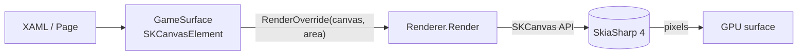
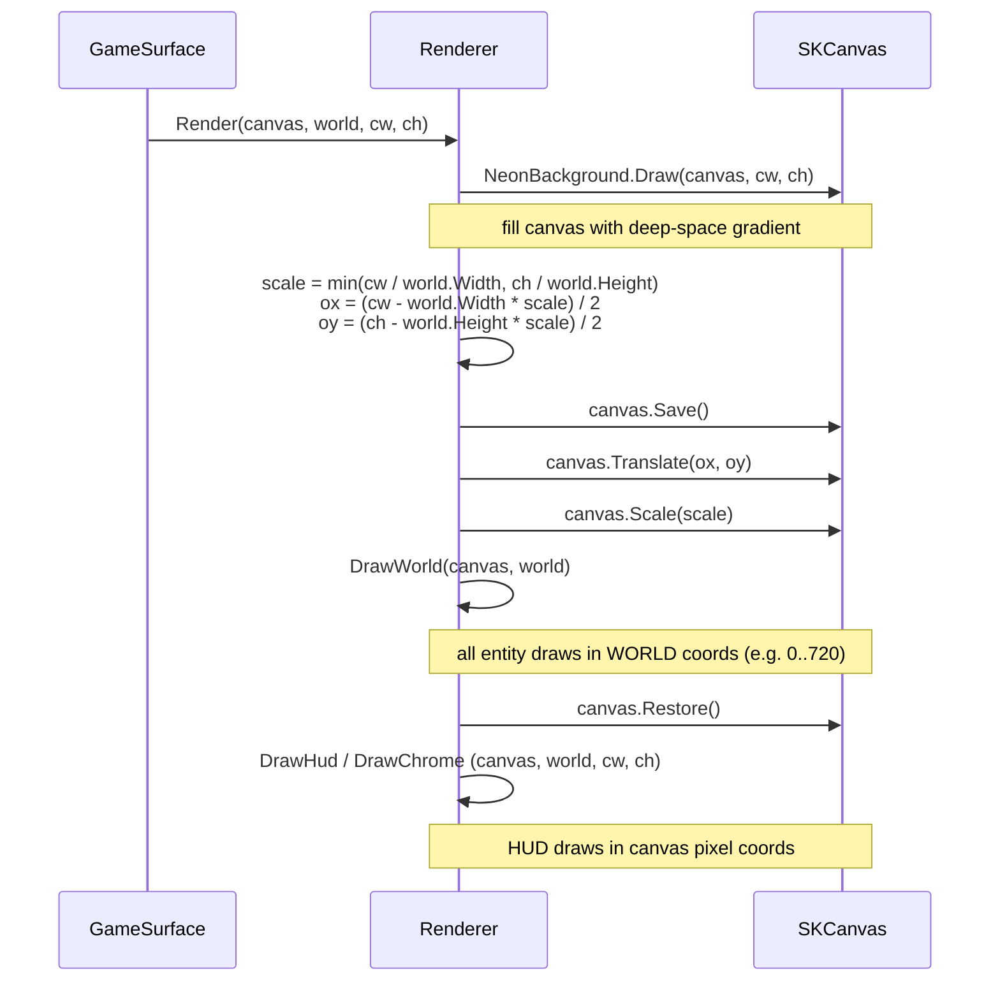
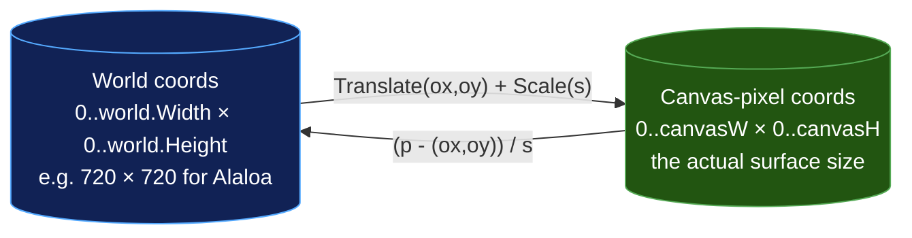
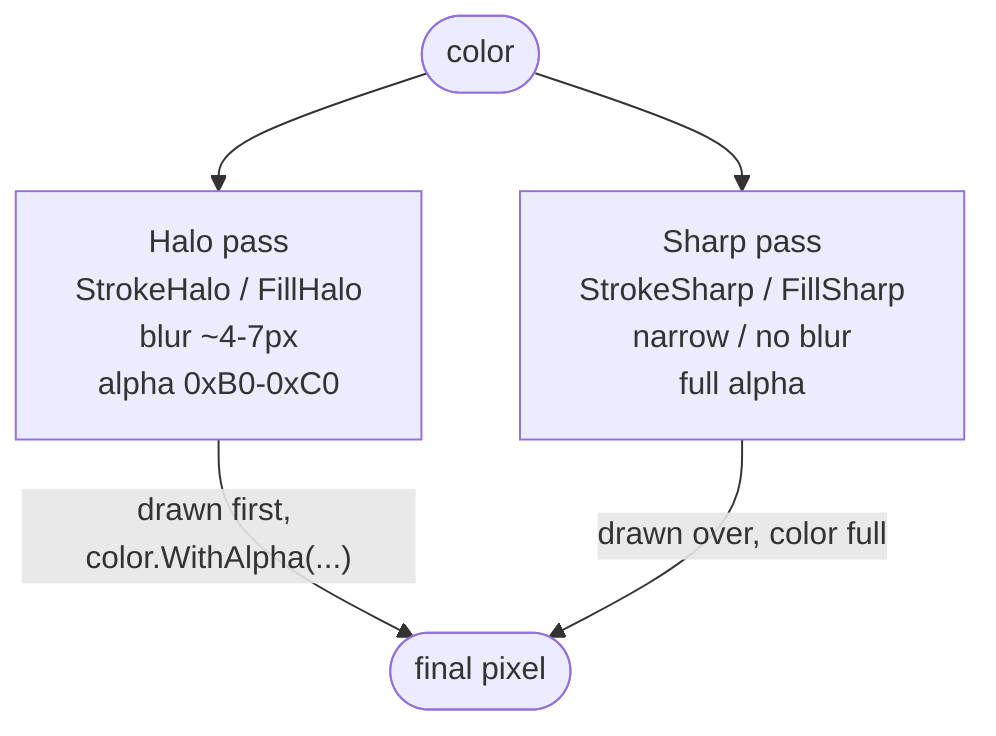
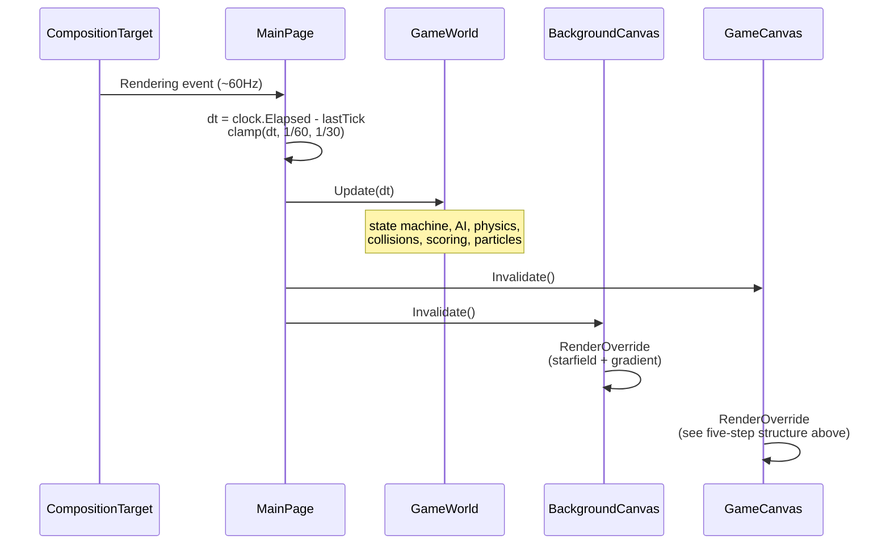

# 04 – Rendering Pipeline

This doc traces a single frame from Uno's render tick down to actual pixels — what `SKCanvasElement` is, how the playfield-world coordinate system relates to canvas pixels via the Viewbox, and why the chassis paints almost everything as a halo+sharp double pass.

## The Uno + Skia chain

The chassis sits on top of `Uno.WinUI.Graphics2DSK` — Uno's built-in `SKCanvasElement`. That gives us a XAML control whose `RenderOverride(SKCanvas canvas, Size area)` runs on the UI thread once per Invalidate. We don't touch lower-level Skia plumbing.



`SKCanvasElement` is doing the heavy lifting — surface creation, present, dirty tracking, scale-factor handling. The renderer just paints into a passed-in `SKCanvas`.

## What every Renderer.Render does

Every arcade demo's `Renderer.cs` exposes the same static entry point:

```csharp
public static void Render(SKCanvas canvas, GameWorld world, float canvasW, float canvasH)
```

The body follows a strict five-step structure:



1. **Fill the background**. `NeonBackground.Draw` paints the vertical gradient over the whole canvas before any letterbox math runs, so even the bands above/below the world fill cleanly.
2. **Compute scale + offset**. The world has a fixed natural size (`world.Width × world.Height`). We pick the largest uniform scale that fits inside the canvas and center via `ox`, `oy`. This is the same math the outer XAML `<Viewbox>` performs to size the GameSurface — but the renderer also has to do it internally because the canvas may be slightly larger than the world (e.g., Hahai's GameSurface is 672×844 to leave HUD bands around the 672×744 maze).
3. **Apply the world transform**. `Save`, `Translate`, `Scale`. From this point until `Restore`, all draw calls are in world coords.
4. **DrawWorld**. The game-specific entity rendering — arena, player, enemies, particles, score popups.
5. **HUD overlay**. After `Restore` the canvas is back in pixel coords; HUD (score, lives, level, title, marquee, placard) draws here so it sits at fixed-pixel sizes regardless of how the world was scaled.

## The two coordinate systems



| Used for | Coord system | Why |
|---|---|---|
| Entity positions, AI distances, collision math | World | Constant — doesn't change with window resize. Physics tunables stay readable (e.g., 144 px/sec at 8px cells = 18 cells/sec). |
| HUD text, marquee, score icons | Canvas-pixel | Stays the same readable size regardless of window resize. |
| Pointer events | Canvas-pixel (raw) → World (unprojected) | The OS gives canvas-pixel coords; demos that need to hit-test against world entities (e.g., Launcher's card tap) unproject manually. |

Pointer unprojection example from `Launcher/MainPage.xaml.cs`:

```csharp
(float wx, float wy) CanvasToWorld(float px, float py)
{
    float cw = (float)GameCanvas.ActualWidth;
    float ch = (float)GameCanvas.ActualHeight;
    float scale = MathF.Min(cw / _world.Width, ch / _world.Height);
    float ox = (cw - _world.Width  * scale) / 2f;
    float oy = (ch - _world.Height * scale) / 2f;
    return ((px - ox) / scale, (py - oy) / scale);
}
```

## The halo + sharp double pass

The neon look is a single technique applied everywhere: every glowing element is drawn twice — once with a wide blurred stroke / fill at reduced alpha (the halo), then again with a narrow crisp stroke / fill at full alpha (the sharp).



The visual signature comes from the blurred halo bleeding into adjacent pixels while the sharp pass keeps the silhouette readable. The chassis enforces this through:

- `NeonDraw.Stroke / Line / CircleFill` — automatically does the two passes.
- `HudText.Draw` — automatically does the two passes for text.
- `NeonPaints.MarqueeHalo / MarqueeSharp` — used by Marquee + DrawRainbowTitle for glyph rendering.
- `NeonPaints.FillHalo / FillSharp` and `NeonPaints.StrokeHalo / StrokeSharp` — directly mutable for game-specific draws that don't fit the helpers.

Important invariant: helpers that change `StrokeWidth` on the shared paints (e.g., `NeonDraw.Line(..., halo: 8f)`) MUST restore the default afterward, or the next caller inherits a wrong width. See the comment block at the top of [`NeonPaints.cs`](../../Source/Common/Chassis/NeonPaints.cs).

## Driving the render loop

The render tick is driven from `MainPage`:



- We subscribe to `CompositionTarget.Rendering` (a global render tick) rather than driving our own timer. Uno fires this just before the compositor draws, so our `Invalidate()` is honored in the same frame.
- Both canvases are invalidated every tick. The background starfield needs continuous redraws to drift; the playfield obviously needs them for state animation.

## Special cases

| Demo | Variant |
|---|---|
| Hahai | World is 672×744 (maze); GameSurface is 672×844. The extra 100px of canvas height becomes HUD bands above (50px) and below (50px) the maze. Renderer's center-and-letterbox math handles this automatically — `oy = (844 - 744) / 2 = 50`. |
| Lua + HokuLele | Portrait aspect (world 540×960) — Viewbox letterboxes left/right. |
| Launcher | World is 1280×720 widescreen, Renderer's main task is just card-grid layout. |
| Uno3dViewer | Uses `GLCanvasElement` (OpenGL), not `SKCanvasElement`. Doesn't follow this pipeline at all. |

## Why this design

| Decision | Why |
|---|---|
| Static `Renderer.Render(canvas, world, w, h)` instead of a renderer instance | Game state lives in `GameWorld`; renderer is stateless. Means we can build/test the world without spinning up any UI. |
| World-coord drawing inside a Save/Scale, HUD in canvas coords | Game tunables stay independent of window size; HUD stays a constant readable size. |
| `CompositionTarget.Rendering` instead of `DispatcherTimer` | Cheaper (no extra ticker), better aligned with the present cycle, and we get the "right" dt for the frame about to be painted. |
| Two canvas elements (background + playfield) | The background is conceptually separate and may continue animating during UI freezes that affect the playfield (e.g., a placard dialog could pause the world but the stars keep moving). Also makes the Viewbox letterboxing visually clean — the BackgroundSurface fills the bars. |
| Pre-allocated static SKPaints | Skia paint creation is non-trivial cost; the chassis builds the six paints once and mutates `Color` per draw. Tens of thousands of draws per second stay GC-free. |
