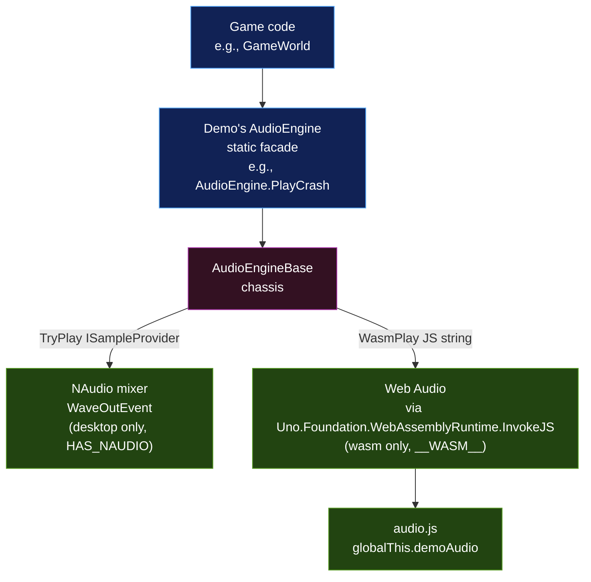
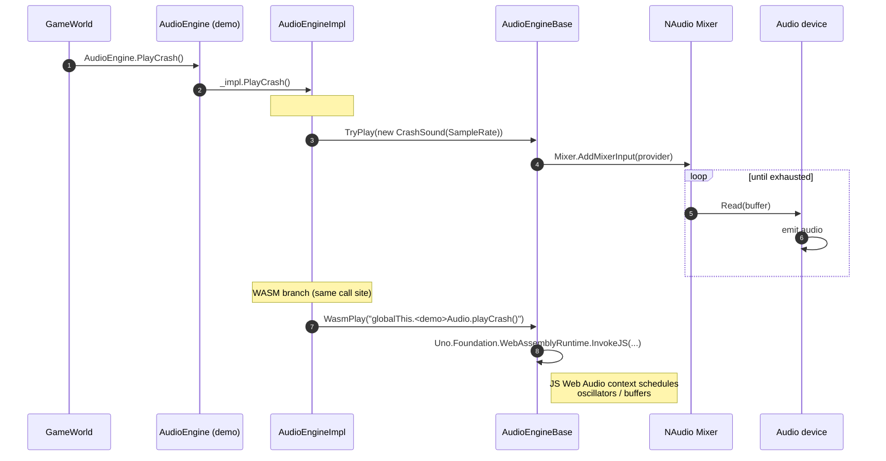

# 05 – Audio

The arcade-family demos all play purely procedural audio — no sample files, no decoders. Each demo defines a small set of voices (chomp, crash, fanfare, etc.); the chassis handles the cross-platform dispatch so the same `AudioEngine.PlayCrash()` call works on desktop, browser, or other TFMs.

## Architecture



Three layers:

1. **Game-facing facade** — a static class per demo (e.g., `Hahai.Game.AudioEngine`) that game code calls. Exposes named methods like `PlayCrash()` / `PlayChomp()` / `PlayPower()` — one per voice.
2. **Voice definitions** — per-demo `ISampleProvider` classes (for NAudio) + per-demo `audio.js` (for Web Audio). Each voice procedurally generates its waveform.
3. **Chassis base** — `Arcade.Common.Audio.AudioEngineBase` handles platform plumbing (init/teardown, dispatch).

## Conditional compilation

Audio behavior depends on the target framework. The csproj wires up the right constants:

```xml
<!-- NAudio is Windows-only; conditionally referenced for the desktop TFM,
     with HAS_NAUDIO compile constant so AudioEngine no-ops on wasm. -->
<ItemGroup Condition="'$(TargetFramework)' == 'net10.0-desktop'">
  <PackageReference Include="NAudio" />
</ItemGroup>
<PropertyGroup Condition="'$(TargetFramework)' == 'net10.0-desktop'">
  <DefineConstants>$(DefineConstants);HAS_NAUDIO</DefineConstants>
</PropertyGroup>
```

`__WASM__` is set automatically by the Uno SDK on the browserwasm TFM. The chassis uses both:

| Constant | Source | Used for |
|---|---|---|
| `HAS_NAUDIO` | Per-demo csproj on desktop TFM only | Gates NAudio types + the desktop voice classes inside `#if HAS_NAUDIO`. |
| `__WASM__` | Uno SDK on browserwasm TFM | Gates the `Uno.Foundation.WebAssemblyRuntime.InvokeJS` call so other TFMs don't reference the WebAssembly assembly. |

This means a TFM that has neither (hypothetical iOS / Android build) silently produces a no-op `AudioEngine` — every method call returns immediately without crashing.

## The desktop path (NAudio)

`AudioEngineBase.Init()` creates a single shared mixer + output:

```csharp
Mixer = new MixingSampleProvider(WaveFormat.CreateIeeeFloatWaveFormat(SampleRate, 1));
Mixer.ReadFully = true;
Output = new WaveOutEvent { DesiredLatency = 60 };
Output.Init(Mixer);
Output.Play();
```

A voice is just an `ISampleProvider` that yields a finite number of samples. The chassis exposes `TryPlay(provider)` which adds the provider to the mixer; once it finishes producing samples NAudio drops it.

Example voice from Alaloa — a short blip on every turn:

```csharp
sealed class TurnSound : ISampleProvider
{
    readonly int _sampleRate;
    readonly int _totalSamples;
    int _sample;
    public WaveFormat WaveFormat { get; }

    public TurnSound(int sampleRate)
    {
        _sampleRate = sampleRate;
        WaveFormat = WaveFormat.CreateIeeeFloatWaveFormat(sampleRate, 1);
        _totalSamples = (int)(0.03 * sampleRate);
    }

    public int Read(float[] buffer, int offset, int count)
    {
        int read = 0;
        for (int i = 0; i < count && _sample < _totalSamples; i++, _sample++, read++)
        {
            float t = (float)_sample / _totalSamples;
            float ang = 2f * MathF.PI * 1400f * _sample / _sampleRate;
            float env = MathF.Exp(-15f * t);
            buffer[offset + i] = MathF.Sin(ang) * env * 0.18f;
        }
        return read;
    }
}
```

Init failures are swallowed silently (`catch { Output = null; }`) — a system without an audio device gets a working game with no sound.

## The wasm path (Web Audio)

`AudioEngineBase.WasmPlay(js)` calls `Uno.Foundation.WebAssemblyRuntime.InvokeJS(js)` with a JS expression. The expression is by convention a call into `globalThis.<demo>Audio`:

```csharp
WasmPlay("globalThis.hahaiAudio && globalThis.hahaiAudio.playChomp(900);");
```

The matching `audio.js` (see [`Source/Hahai/Hahai/Platforms/WebAssembly/WasmScripts/audio.js`](../../Source/Hahai/Hahai/Platforms/WebAssembly/WasmScripts/audio.js)) defines the matching Web Audio voices:

```js
(function () {
    const NS = (globalThis.hahaiAudio = globalThis.hahaiAudio || {});
    // gesture-gate AudioContext creation (autoplay policy)
    NS.ctx = null;
    NS.gestureReceived = false;
    const arm = () => {
        if (NS.gestureReceived) return;
        NS.gestureReceived = true;
        try {
            const AC = window.AudioContext || window.webkitAudioContext;
            NS.ctx = new AC();
            if (NS.ctx.state === "suspended") NS.ctx.resume();
        } catch { /* fail silent */ }
    };
    window.addEventListener('pointerdown', arm, true);
    window.addEventListener('keydown',     arm, true);
    window.addEventListener('touchstart',  arm, true);

    NS.playChomp = function (freq) {
        const ctx = NS.ensure(); if (!ctx) return;
        const osc = ctx.createOscillator();
        const gain = ctx.createGain();
        osc.type = "triangle";
        osc.frequency.setValueAtTime(freq || 720, ctx.currentTime);
        gain.gain.setValueAtTime(0.18, ctx.currentTime);
        gain.gain.exponentialRampToValueAtTime(0.0001, ctx.currentTime + 0.08);
        osc.connect(gain).connect(ctx.destination);
        osc.start(ctx.currentTime);
        osc.stop(ctx.currentTime + 0.10);
    };
    // ...
})();
```

Two wasm-specific concerns:

### 1. Browser autoplay policy

Browsers refuse to start an `AudioContext` until a user gesture (click / keydown / touch). The wasm voice file installs one-shot listeners that create the context on the first interaction, then unsubscribe. Until that happens, every `playFoo()` call returns early. The game itself doesn't need to know.

### 2. audio.js bundling

The Uno SDK auto-globs known `WasmScripts/` files like `AppManifest.js` and `Fonts.css`, but arbitrary additions need an explicit `<EmbeddedResource>` to be picked up by the bootstrapper. Every audio-enabled demo's csproj has:

```xml
<ItemGroup Condition="'$(TargetFramework)' == 'net10.0-browserwasm'">
  <EmbeddedResource Include="Platforms\WebAssembly\WasmScripts\audio.js" />
</ItemGroup>
```

Without this, the file ships in the wasm bundle as static content but the bootstrapper never `<script>`-loads it, and `globalThis.<demo>Audio` is undefined.

## A sound event end-to-end



Both branches execute every call — the platform-specific one runs and the other is a no-op. Branchless writes to multiple targets cost nothing on the inactive platform.

## Voice patterns used

The arcade family reuses a handful of waveform shapes for procedural voices:

| Shape | DSP technique | Where it's used |
|---|---|---|
| Decaying sine | `sin(ωt) * exp(-kt)` | Turn blips, pellet chomps, button clicks |
| Filtered noise + decaying saw | `noise * LPF(0.72) + saw * exp(-3t)` | Crashes, explosions, deaths |
| Triangle arpeggio | iterate over frequency list, each with `exp(-2.5t)` envelope | Round-win / level-clear / power-pellet fanfares |
| Sine with pitch wobble | `sin(ω * (1 + 0.18*sin(ω_mod*t)) * t)` | Death sounds (Hahai) — descending pitch with vibrato |

## Per-demo audio inventory

| Demo | Voices |
|---|---|
| Pohaku | thrust, fire, hit, explode, hyperspace |
| HokuLele | fire, hit, dive, beam-capture, mothership, lose-life, level-clear |
| Lua | shoot, hit, super-zapper, warp, lose-life, level-clear |
| Mahina | thrust (looped), touchdown, crash, refuel, attract-fanfare |
| Heiau | turret-fire, ring-segment-hit, wall-break, mine-spawn, ship-hit, win |
| Kanapi | shoot, mushroom-hit, centipede-hit, spider-hit, lose-life, level-clear |
| Alaloa | turn, crash, round-win, round-lose |
| Hahai | chomp (hi/lo alternating), power-pellet, eat-ghost, death, level-clear |
| Launcher | (none — silent by design) |
| UnoGallery, KahuaNetwork | use their own non-chassis audio paths |

## Adding a new voice

1. Add a method to the demo's `AudioEngine` facade — e.g., `public static void PlayBoom() => _impl.PlayBoom();`.
2. Inside `AudioEngineImpl`, implement `PlayBoom` with both branches:
   ```csharp
   public void PlayBoom()
   {
   #if HAS_NAUDIO
       TryPlay(new BoomSound(SampleRate));
   #endif
       WasmPlay("globalThis.<demo>Audio && globalThis.<demo>Audio.playBoom();");
   }
   ```
3. Add a `BoomSound : ISampleProvider` nested inside `#if HAS_NAUDIO` block.
4. Add `NS.playBoom = function () { ... }` to `audio.js`.
5. Call `AudioEngine.PlayBoom()` from wherever in `GameWorld` it makes sense.

Both implementations should aim for similar perceptual envelope so the game feels the same on desktop and in the browser.
