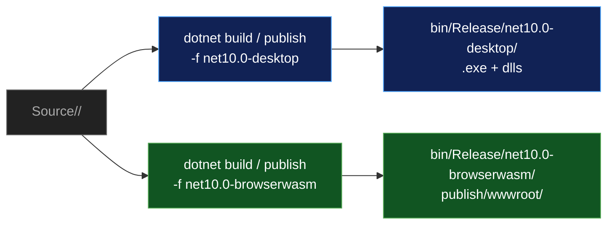
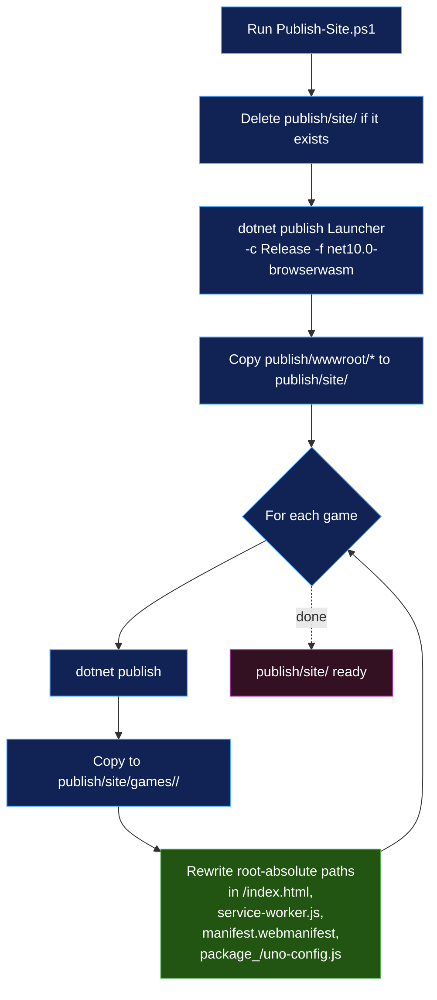

# 06 – Build and Deploy

How the repo builds and how the wasm site gets packaged. Per-demo build mechanics are deliberately simple — every demo is a single self-contained `dotnet build`. The interesting work is the `Publish-Site.ps1` pipeline that bundles the launcher + every wasm game into a single static-site layout.

## Builds folder

```
Builds/
├── Build-All.ps1                  ← aggregator
├── Build-<Demo>.ps1               ← per-demo build wrapper
├── Run-<Demo>.ps1                 ← per-demo run wrapper
├── Capture-Demo.ps1               ← window screenshot (desktop only)
├── Test-All.ps1                   ← test aggregator
├── Test-Common.ps1                ← chassis suite
├── Test-Arcade.ps1                ← all-demos suite
└── Publish-Site.ps1               ← wasm site bundler
```

Each `Build-` / `Run-` script is a thin wrapper around `dotnet build` / `dotnet run` that adds:

- `-Configuration <Debug|Release>` (default `Release`)
- `-Wasm` switch to flip TFM between `net10.0-desktop` and `net10.0-browserwasm`
- Color-coded console output + uniform exit code propagation

Example:

```powershell
[CmdletBinding()]
param([string]$Configuration = 'Release', [switch]$Wasm)
$ErrorActionPreference = 'Stop'
$framework = if ($Wasm) { 'net10.0-browserwasm' } else { 'net10.0-desktop' }
$repoRoot = Split-Path -Parent $PSScriptRoot
$project  = Join-Path $repoRoot 'Source\Alaloa\Alaloa\Alaloa.csproj'
dotnet build $project -c $Configuration -f $framework --nologo
exit $LASTEXITCODE
```

## Multi-targeting

Every csproj declares:

```xml
<TargetFrameworks>net10.0-browserwasm;net10.0-desktop</TargetFrameworks>
```

(UnoGallery additionally targets the mobile TFMs; Uno3dViewer is desktop-only.)

`net10.0-desktop` is Windows-only and produces a self-contained .exe. `net10.0-browserwasm` produces a wasm bundle that runs in any modern browser.



## Build-All aggregator

```powershell
.\Builds\Build-All.ps1                       # Release, desktop
.\Builds\Build-All.ps1 -Configuration Debug  # Debug, desktop
.\Builds\Build-All.ps1 -Wasm                 # Release, wasm — skips Uno3dViewer
```

Loops the `$scripts` array and invokes each `Build-<Demo>.ps1`. Tracks failures and prints a summary at the end. `Build-All -Wasm` automatically skips Uno3dViewer (it has no browserwasm TFM) — the skip is logged for visibility.

## Running the tests

```powershell
.\Builds\Test-All.ps1
.\Builds\Test-Common.ps1 -Filter "FullyQualifiedName~Camera2DTests"
```

Two MSTest suites — `Source/Common.Tests/` for the shared chassis and
`Source/Arcade.Tests/` for all twelve demos — both on plain `net10.0` with no Uno SDK,
no window and no GPU. `Test-All.ps1` mirrors `Build-All.ps1`'s shape and is
deliberately **not** invoked by it: a failing test should not block a build. Full
detail in [10 – Testing](10-Testing.md).

## Capturing a screenshot

Every demo is a Skia canvas, so "did that change actually render?" is the question that matters most —
and the one a green build says nothing about. `Capture-Demo.ps1` answers it without a human watching
the window:

```powershell
.\Builds\Capture-Demo.ps1 -Demo Eli                              # capture what's already running
.\Builds\Capture-Demo.ps1 -Demo Eli -Launch -DelaySeconds 16     # start it, wait for attract mode
.\Builds\Capture-Demo.ps1 -Demo Hahai -Out shots\hahai.png       # explicit output path
```

Output defaults to `publish/screenshots/<Demo>-<timestamp>.png`; `/publish/` is gitignored, so
captures never land in the working tree by accident.

The capture goes through Win32 `PrintWindow` with `PW_RENDERFULLCONTENT`, which asks the window to
render its own surface into a bitmap. That matters: the obvious alternative,
`Graphics.CopyFromScreen`, grabs the *screen region* the window occupies, so anything overlapping the
demo — an editor, a terminal — ends up in the shot. `PrintWindow` comes back blank on some
GPU-composited windows, so the script samples a grid of pixels and falls back to `CopyFromScreen` with
a warning rather than silently saving a black rectangle.

Desktop only — there is no window to capture on browserwasm. Exits 1 if no matching demo window is
running.

## The static-site pipeline

`Publish-Site.ps1` produces a single static-site layout containing the launcher and every wasm game. Output goes to `publish/site/` by default (or whatever `-OutputDir` you pass).



### Step 1: Clean

The script deletes `publish/site/` at the start so re-running is idempotent. This avoids stale state from a previous publish leaking into the new one.

### Step 2: Publish the launcher to site root

`dotnet publish` on `Launcher.csproj` for browserwasm produces a `publish/wwwroot/` folder with:

- `index.html`
- `_framework/` — wasm runtime + DLLs
- `package_<hash>/` — bundled Uno assets (Uno.Wasm.js, AppManifest.js, fonts, etc.)
- `service-worker.js`, `manifest.webmanifest`, `favicon.ico`

That whole tree gets copied to `publish/site/` (site root). The launcher uses absolute paths internally — they work because it lives at the root.

### Step 3: Publish each game

For each game in the `$games` array, `dotnet publish` produces a similar tree which gets copied to `publish/site/games/<slug>/`. The slugs are lowercase folder names (e.g., `pohaku`, `hokulele`, `lua`, `mahina`, `heiau`, `kanapi`, `alaloa`, `hahai`).

### Step 4: Rewrite root-absolute paths

This is the critical step that makes per-game subfolder deployment work. Uno's wasm bootstrap bakes site-root-absolute paths (`/package_<hash>/...`, `/_framework/...`, `/manifest.webmanifest`, `/service-worker.js`) into multiple files. When a game is served from `/games/<slug>/`, those `/` paths still resolve to the site root, not to the game's subfolder — so every asset 404s.

The fix is post-publish text replacement. For each game's tree, three transforms run over `index.html`, `service-worker.js`, `manifest.webmanifest`, and `package_<hash>/uno-config.js`:

```
"/foo..." → "./foo..."   (most app-local paths)
"/"       → "./"         (root entry in offline_files / scope in manifest)
"/."      → "./."        (current-dir sentinel)
```

The regex is anchored on the opening quote so it only touches quoted string literals — bare path text elsewhere (e.g., comments, JSON values that happen to start with `/`) is untouched.

After rewriting, the game's loader resolves all paths relative to its own document URL, so `/games/hahai/index.html` correctly loads `/games/hahai/package_xxx/uno-bootstrap.js` instead of `/package_xxx/uno-bootstrap.js`.

The launcher itself is at the site root, so its absolute paths are correct — no rewriting needed there.

### Output layout

```
publish/site/
├── index.html                ← Launcher
├── _framework/
├── package_<hash>/
├── service-worker.js
├── manifest.webmanifest
├── favicon.ico
└── games/
    ├── pohaku/
    │   ├── index.html        ← rewritten
    │   ├── _framework/
    │   ├── package_<hash>/   ← uno-config.js rewritten
    │   ├── service-worker.js ← rewritten
    │   ├── manifest.webmanifest ← rewritten
    │   └── ...
    ├── hokulele/
    ├── lua/
    ├── mahina/
    ├── heiau/
    ├── kanapi/
    ├── alaloa/
    └── hahai/
```

## Serving locally

Any static host works. The script logs two ready-to-paste commands:

```powershell
.\Builds\Publish-Site.ps1
dotnet serve -d .\publish\site -p 8080
# or
python -m http.server 8080 --directory .\publish\site
```

Then open http://localhost:8080/ — the launcher loads at the root, clicking a card navigates to `/games/<slug>/`.

## Service-worker hygiene

The launcher (and every game) registers a service worker that caches all wasm assets aggressively. After republishing, browsers will keep serving the cached version unless you clear it:

**F12 → Application → Storage → Clear site data → hard-refresh (Ctrl+Shift+R).**

If you skip this step after a republish you'll see stale game code, broken paths, or both. The cache clears once and the next publish hot-loads.

## Production deployment

The `publish/site/` tree is "drop on any static host" — Azure Static Web Apps, GitHub Pages, Netlify, Vercel, S3 + CloudFront, and plain Apache/nginx all work. Nothing in the tree requires server-side compute. The included `staticwebapp.config.json` and `web.config` from Uno's publish are functional for SWA and IIS hosts that read them; on hosts that ignore them the site still works because the wasm bundle is self-contained.

Two things worth noting for production:

- **Brotli + gzip** versions of every asset ship in the output (`.br`, `.gz`). If the host can negotiate `Content-Encoding`, you get the compressed payloads automatically.
- **Service worker scope** — the launcher SW controls `/`, and each game SW controls `/games/<slug>/`. They don't conflict because their scopes are nested. A user who plays Pohaku then opens the launcher won't double-fetch; the launcher's SW handles the navigation back.

## When to add what to the build scripts

| Change | Update |
|---|---|
| New demo | Add `Builds/Build-<New>.ps1` + `Builds/Run-<New>.ps1`; append script name to `Build-All.ps1` `$scripts`. |
| New wasm-publishable demo (game) | Also append the slug to `Publish-Site.ps1` `$games`. |
| New shared chassis file | Nothing — `<Compile Include="..\..\Common\**\*.cs"/>` glob picks it up automatically next build. |
| Screenshotting a demo | Nothing — `Capture-Demo.ps1` resolves the demo by name; no per-demo entry needed. |
| New demo, test coverage | Add its `Game/**/*.cs` to `Arcade.Tests.csproj` and an entry to `DemoRegistry.All`; every existing check is data-driven off that registry. |
| New per-demo audio voice | Csproj already has `<EmbeddedResource Include="...audio.js"/>` — nothing to change for the build. |
