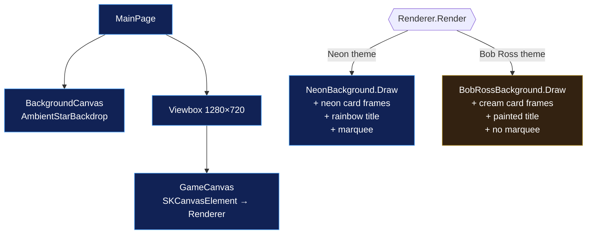
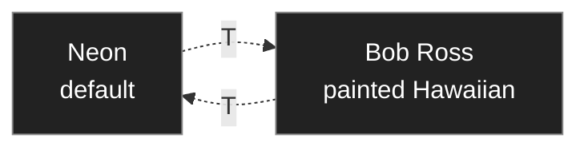
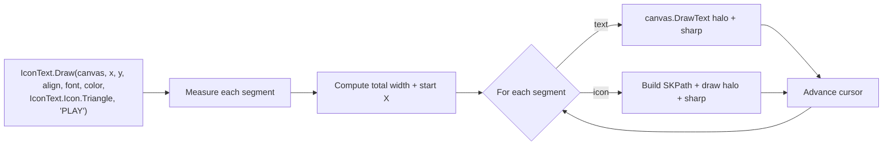

# 07 – Launcher

The Launcher is a catalog landing page that lists every demo and click-launches each one. It's both a regular Uno + Skia demo (sharing the chassis) and the entry-point for the bundled static-site deploy. This doc covers how it picks targets, how the two themes work, and how to add a tile.

## The model

A single source of truth — [`GameCatalog.cs`](../../Source/Launcher/Launcher/Game/GameCatalog.cs) — holds an array of `Entry` records:

```csharp
public sealed record Entry(
    string Name,           // POHAKU, HOKULELE, …
    string Gloss,          // "stone", "shooting stars", …
    string OriginalGame,   // Asteroids, Galaga, …
    string Description,    // one-line tagline
    SKColor Color,         // card accent + glow
    string WasmPath,       // "/games/pohaku/" — for wasm navigation
    string FolderName);    // "Pohaku" — Source/<FolderName>/<FolderName>/<FolderName>.csproj
```

The card grid, click dispatch, hover tooltip, and Publish-Site `$games` array all derive from these entries. Adding a row to `GameCatalog.Games` adds a tile.

## Layout



Layout numbers (in `Renderer.cs`):

- World: 1280 × 720 (fixed).
- Card grid: 4 columns × ceil(N/4) rows, with 36px side padding and 18px card gaps, occupying y ∈ [170, 620].
- Title at y ≈ 0.04 × ch (top), subtitle at y ≈ 0.18 × ch, marquee at y ≈ 0.97 × ch (Neon theme only).

## Click dispatch

Clicking a card invokes `NavigateToGame(entry)`, which branches by TFM:

```mermaid
flowchart TB
    Click{{Card click}}
    Click --> TFM{TFM?}

    TFM -->|"#if __WASM__"| W[Set window.location.href = entry.WasmPath]
    W --> WLoad[Browser loads /games/&lt;slug&gt;/index.html]

    TFM -->|"#else (desktop)"| D[FindRepoRoot walks up from AppContext.BaseDirectory]
    D --> Probe{Check exe<br/>at each path}
    Probe -->|"bin/Release/.../<Folder>.exe exists"| R[Process.Start the Release exe]
    Probe -->|"else bin/Debug/.../<Folder>.exe exists"| Dbg[Process.Start the Debug exe]
    Probe -->|neither| Fall["Process.Start: dotnet run --project &lt;csproj&gt;"]

    R --> Game[Game window opens (~sub-second)]
    Dbg --> Game
    Fall --> Game2[Game window opens after MSBuild rebuild (~seconds)]
```

### Desktop dispatch in detail

```csharp
string gameDir = Path.Combine(repoRoot, "Source", entry.FolderName, entry.FolderName);
foreach (var cfg in new[] { "Release", "Debug" })
{
    string exe = Path.Combine(gameDir, "bin", cfg, "net10.0-desktop", $"{entry.FolderName}.exe");
    if (File.Exists(exe))
    {
        Process.Start(new ProcessStartInfo
        {
            FileName = exe, UseShellExecute = true, WorkingDirectory = Path.GetDirectoryName(exe),
        });
        return;
    }
}
// Fallback: dotnet run on the csproj
```

The probe order (Release before Debug) means a `Build-All -Configuration Release` produces the fastest possible click-to-launch experience. The fallback to `dotnet run` ensures fresh clones still work — it's just slower because MSBuild has to rebuild before the game window opens.

`FindRepoRoot()` walks up the directory tree from `AppContext.BaseDirectory` until it finds a sibling `Source/` folder. This lets the launcher work regardless of whether it's been published or is running out of `bin/Release/`.

### WASM dispatch in detail

```csharp
try { Uno.Foundation.WebAssemblyRuntime.InvokeJS($"window.location.href = '{entry.WasmPath}';"); }
catch { /* fail silent */ }
```

A simple navigation. The catch is by design — if interop is broken for any reason, the launcher stays visible rather than crashing.

The `WasmPath` only works if the games have been published to `/games/<slug>/` alongside the launcher. In a local dev session running `dotnet run -f net10.0-browserwasm` against just the launcher, clicking a card 404s — this is documented in the inline code comment and isn't a launcher bug.

## Themes

Two themes are toggled by the **T** key, persisted in `LauncherWorld.Theme`:



| Aspect | Neon | Bob Ross |
|---|---|---|
| Background | Deep-space gradient + drifting starfield (`AmbientStarBackdrop`) + `NeonBackground.Draw` | `BobRossBackground.Draw` — pastel sky gradient, clouds, hazy sun, layered mountain silhouettes with snow caps on the back layer, gradient ocean + golden sun-reflection trail, silhouette palms |
| Card background | Opaque dark purple (alpha 0xC0) | Translucent cream (alpha 0x88) so the painting reads through |
| Card border | Glowing neon stroke in game's accent color | Espresso brown wood-frame + inner accent stripe in game's color |
| Title font color | Per-glyph hue-cycling rainbow | Cream + deep brown shadow, single warm pigment |
| Subtitle font | Consolas + neon halo | Georgia italic + warm cream |
| Marquee | Visible at y=0.97 × ch | Hidden — would fight the painterly mood |
| Hover tooltip | Game accent color (full saturation) | Game accent color darkened to 0.55× saturation |

Both themes share the same card layout, hit testing, and click dispatch — only paint changes.

## Files

| File | Purpose |
|---|---|
| [`GameCatalog.cs`](../../Source/Launcher/Launcher/Game/GameCatalog.cs) | Source of truth — array of `Entry` records. |
| [`LauncherWorld.cs`](../../Source/Launcher/Launcher/Game/LauncherWorld.cs) | Lightweight state: pointer position, hover/press indices, card hit-rects array, current `LauncherTheme`. |
| [`Renderer.cs`](../../Source/Launcher/Launcher/Game/Renderer.cs) | Card grid layout + per-theme `DrawCardNeon` / `DrawCardBobRoss` + chrome (title, subtitle, tooltip, marquee). |
| [`BobRossBackground.cs`](../../Source/Launcher/Launcher/Game/BobRossBackground.cs) | Painted sunset scene — sky / sun / clouds / mountains / snow / ocean / sun-reflection / palms. |
| [`IconText.cs`](../../Source/Launcher/Launcher/Game/IconText.cs) | Vector-drawn ▶ / → / ► / — glyphs as SKPath shapes + a single-call helper that lays out alternating text/icon segments. Used because SkiaSharp wasm's fallback font lacks those code points. |
| [`MainPage.xaml`](../../Source/Launcher/Launcher/MainPage.xaml) / [`.cs`](../../Source/Launcher/Launcher/MainPage.xaml.cs) | Pointer + key input, Viewbox layout, render loop, T-key theme toggle, click dispatch (exe-direct desktop + wasm navigate). |
| [`BackgroundSurface.cs`](../../Source/Launcher/Launcher/BackgroundSurface.cs) | Thin wrapper around `Arcade.Common.AmbientStarBackdrop`. |

## Why IconText exists

The launcher uses ▶ → ► — in its UI text (PLAY indicators, gloss → original, tooltips, em-dashes). SkiaSharp's wasm build uses a fallback font that doesn't include the Geometric Shapes / Arrows / General Punctuation Unicode blocks, so those glyphs render as boxes or gaps.

Rather than ship an alternate font, the launcher draws those specific glyphs as `SKPath` shapes. [`IconText.cs`](../../Source/Launcher/Launcher/Game/IconText.cs) provides a single helper that takes alternating text segments and icon enum values, measures them all, and lays them out at the caller's alignment point — same neon halo+sharp paint stack as the rest of the chassis. The icons resize with the surrounding font.



## Adding a tile

1. Add an `Entry(...)` row to `GameCatalog.Games` with matching `FolderName` (so desktop dispatch can find the exe) and `WasmPath` (so wasm dispatch can navigate).
2. Append the matching slug to `$games` in `Builds/Publish-Site.ps1`.
3. Rebuild the launcher (`.\Builds\Build-Launcher.ps1 -Configuration Release`) so the new card appears.
4. Re-publish the site (`.\Builds\Publish-Site.ps1`) if you want it live on the wasm deploy too.

The card layout auto-flows — adding the 9th tile creates a third row; the 12th adds a fourth row.
