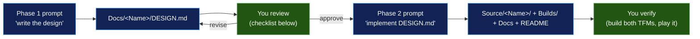

# 09 – Authoring a New-Game Prompt

How to write the prompt that makes an AI coding agent produce a new arcade-family game that actually
fits this repo. This is a process doc, not an architecture doc — it assumes the reader is about to
type a prompt, not read code.

Kia'i ([Docs/Kiai/DESIGN.md](../Kiai/DESIGN.md)) and Koa ([Docs/Koa/DESIGN.md](../Koa/DESIGN.md)) were
both produced this way, and the shape of those two documents is the target output. Everything below is
derived from what those two runs needed stated explicitly, and from what gets produced when it isn't.

## Why the prompt has to carry this much

"Build me a Dig Dug clone in Uno + SkiaSharp" produces a working game that is **wrong for this repo**.
The repo's conventions are almost entirely invisible from a cold read of one demo folder:

- The chassis is **source-included**, not project-referenced ([03](03-Shared-Chassis.md)) — an agent
  that doesn't know this will create `Common.csproj`, which breaks per-demo SkiaSharp pinning.
- There are **two layout families** (fixed `Viewbox` vs stretched `GameSurface` + `Camera2D`), and
  picking the wrong one means rewriting the renderer ([08](08-Chassis-Extensions.md)).
- The **4-state** mode machine is standard; Pohaku's 3-state version is legacy and looks equally
  canonical if you happen to open Pohaku first ([02](02-Demo-Anatomy.md#the-canonical-game-state-machine)).
- **Do not add a launcher card.** The repo owner reversed that: `GameCatalog.cs` stays at its original
  eight entries and new games ship standalone ([08 § What was deliberately not built](08-Chassis-Extensions.md#what-was-deliberately-not-built)).
  An agent following [02 § Adding a new arcade-family demo](02-Demo-Anatomy.md#adding-a-new-arcade-family-demo)
  step 6, or the root README's step 4, will add one anyway — both predate the reversal.
- There is **no test project anywhere in the repo**. Ask for tests and you get a new test-infrastructure
  decision you didn't want to make.

So the prompt's job is not to describe a game. It is to **fence the solution space**, so the agent's
freedom is spent on gameplay rather than on re-deciding architecture that's already settled.

## The two-phase workflow

Don't ask for a game. Ask for a **plan**, review it, then ask for the implementation of that plan.



Why split it: the design doc is cheap to correct and the implementation is not. Both shipped DESIGN
docs cite **exact `file:line` references** into the demos they copied (`Pohaku/GameWorld.cs:406-414`,
`Hahai/Renderer.cs:74-75`). That's the tell that the agent actually read the code instead of
generalising from its training data — a plan without those citations is a plan to review harder.

The design doc also survives the run. [Docs/Kiai/DESIGN.md](../Kiai/DESIGN.md) still opens with a
`> **Status: built.**` banner and is now that game's primary doc; that's the intended end state, so
have Phase 2 add the banner rather than delete the file.

## Phase 1: the design prompt

Ten blocks. The first three are the game; the other seven are the fence.

| # | Block | What it prevents |
|---|---|---|
| 1 | **Required reading** — name the docs, in order | An agent inventing a chassis it can't see |
| 2 | **Identity** — name, gloss, homage, accent color | Off-convention naming, a clashing palette |
| 3 | **Elevator pitch** — one paragraph, the mechanics you actually want | Genre drift |
| 4 | **Reference demo to copy** — by name | Wrong layout family |
| 5 | **The architectural delta** — how it differs from that reference | Your game getting smoothed into the template |
| 6 | **Chassis contract** — reuse these; propose additions, don't smuggle them | Duplicated `Camera2D`s, local reimplementations |
| 7 | **Non-negotiables** — the invariant list | Legacy patterns, `DispatcherTimer`, unpinned versions |
| 8 | **Wiring checklist** — scripts, publish list, docs, *no catalog entry* | A broken `Build-All`, an unwanted launcher card |
| 9 | **Deliverable + acceptance** — a design doc at a named path, with citations | A wall of chat prose you can't review |
| 10 | **Out of scope** — explicitly | Test projects, `Pool<T>`, cross-demo refactors |

### Block 1 — required reading

Name the files. Ordered, with one clause each on why:

```
Read these before writing anything, in this order:
- Docs/Architecture/01-Overview.md            — repo shape, per-demo isolation
- Docs/Architecture/02-Demo-Anatomy.md        — file layout, render loop, the 4-state machine
- Docs/Architecture/03-Shared-Chassis.md      — every chassis piece and its API
- Docs/Architecture/04-Rendering-Pipeline.md  — the five-step Render, world vs canvas coords
- Docs/Architecture/05-Audio.md               — the dual NAudio / Web Audio voice pattern
- Docs/Architecture/06-Build-And-Deploy.md    — what a new demo has to be wired into
- Docs/Architecture/08-Chassis-Extensions.md  — settled decisions; do not relitigate these
- Source/<ReferenceDemo>/                     — the demo you are copying, in full
```

08 is the one people leave out and the one that saves the most rework: it is where "don't build
`Pool<T>`", "don't build `Entity2D`", and "don't add a launcher card" live.

### Block 2 — identity

The naming convention is a Hawaiian word chosen for the *defining mechanic* of the original game, not
a translation of its title ([01 § Hawaiian naming](01-Overview.md#hawaiian-naming)). Give the agent the
word and the gloss — it will otherwise pick something generic.

One mechanical rule worth stating, because it isn't guessable: **the display name may carry an ʻokina;
the folder, namespace, slug, and `ApplicationId` must not.** Kia'i is the precedent — display `KIA'I`,
folder and namespace `Kiai`, slug `kiai`, `com.companyname.kiai`.

Also give the accent color as an `SKColor` literal. Koa's planned `0xFF5533` shipped as `0xFF7744`
because the original read too close to its own damage red — palette collisions with your *own game's*
effect colors are the thing to think about, not collisions with other demos.

### Block 3 — elevator pitch

One paragraph, in the voice of the DESIGN docs' own "Elevator pitch" sections. Include the win/lose
condition, and the resource clock if there is one — Koa's "health drains continuously" is a single
clause that determines its whole HUD.

### Block 4 — reference demo

State it by name. This single line decides more of the output than the pitch does:

| If the new game… | Copy | Because |
|---|---|---|
| has a fixed square playfield | **Alaloa** (720×720) | Cleanest recent `Viewbox` demo |
| has a fixed portrait playfield | **HokuLele** or **Lua** (540×960) | Portrait letterboxing already solved |
| is a fixed-scale tile maze with an authored level | **Hahai** | Grid + ASCII layout + chase AI |
| has a world wider than the screen that wraps | **Kia'i** | Stretched `GameSurface` + `Camera2D` wrap-X + `Radar` |
| has a bounded world larger than the screen | **Koa** | Stretched `GameSurface` + `Camera2D` clamp + `TileGrid` + `FlowField` |
| needs a camera that zooms as the player grows | **Paku** | The one camera `Camera2D` doesn't model |

Pohaku is the reference *implementation* the chassis was factored out of, not a consumer of it — it
hand-rolls its own paints, marquee, and HUD text
([03 § usage matrix](03-Shared-Chassis.md#chassis-by-demo-usage-matrix)). The Kia'i and Koa DESIGN docs
say "the Pohaku stretched-`GameSurface` layout" because those two games didn't exist yet.
**They do now — send the agent to Kia'i or Koa for that layout, not Pohaku.**

### Block 5 — the architectural delta

The highest-value block, and the one only you can write. Both shipped designs have a "What's different
from the existing template" section of three bullets, and both got their whole structure from it. Koa's:

- no Viewbox — `Camera2D` does the framing;
- continuous circle motion against tile walls with axis-separate wall-sliding, **not** Hahai's
  cell-snapped stepping;
- health is the clock.

Write yours the same way: **three to five bullets, each naming the thing in the reference demo it
replaces.** If you can't name what it replaces, you're describing the template, and that bullet is noise.

### Block 6 — chassis contract

Two halves, both needed:

```
Reuse from Source/Common/ — do not reimplement locally:
  <list the pieces you expect, e.g. Camera2D (clamp both axes), TileGrid<Tile>, AsciiMap,
   FlowField, VectorShapes, HudText (+ Bar), Marquee, AmbientStarBackdrop, HighScoreStore,
   AudioEngineBase>

If the game needs a capability the chassis doesn't have, do NOT build it inline and do NOT
build it silently. Propose it in the design doc as a chassis addition with a priority —
P0 (needed before the game), P1 (built with the game), P2 (deferred behind a stated gate) —
and say which other demos would consume it. P2 items stay unbuilt.
```

That priority discipline is how the scrolling-world tier got built, and the P2 gate is why `Pool<T>`
correctly still doesn't exist ([08](08-Chassis-Extensions.md#what-was-deliberately-not-built)).
Naming the pieces you expect is also a cheap correctness check on your own plan: if your list comes out
empty, you probably picked the wrong reference demo.

### Block 7 — non-negotiables

Paste this list nearly verbatim. Every line is something an agent gets wrong by default:

```
- 4-state GameMode { Title, Playing, GameOver, Attract }, with a working Attract autopilot.
  Pohaku's 3-state {Demo, Playing, GameOver} is legacy — do not copy it. Title idles to Attract
  after 12s.
- Drive the loop from CompositionTarget.Rendering, never a DispatcherTimer. dt from a Stopwatch,
  clamped to [1/60, 1/30]. Invalidate both canvases every tick.
- Two canvas layers: BackgroundSurface (sealed : Arcade.Common.AmbientStarBackdrop, override
  BgTop/BgBottom if the mood needs it) behind the GameSurface.
- Renderer is a static Render(SKCanvas, GameWorld, float canvasW, float canvasH) — stateless; game
  state lives in GameWorld. Follow the five-step body in 04: background, transform, world draws,
  restore, HUD in canvas-pixel coords.
- Every glowing element is a halo + sharp double pass, via NeonDraw / HudText / NeonPaints. Any
  helper that mutates a shared paint's StrokeWidth must restore the default before returning.
- The chassis is source-included via <Compile Include="..\..\Common\**\*.cs" .../>. Never create a
  Common.csproj or a ProjectReference to it.
- Per-demo isolation: own .sln, Directory.Build.props, Directory.Packages.props, global.json.
  Nothing build-related at the repo root. Do not modify any other demo.
- Pin SkiaSharp 4.151.0 and Uno.Sdk 6.7.0-dev.164 (match the reference demo exactly).
  TargetFrameworks: net10.0-browserwasm;net10.0-desktop. No mobile TFMs.
- Audio: static AudioEngine facade + AudioEngineImpl : AudioEngineBase. NAudio ISampleProviders
  under #if HAS_NAUDIO, mirrored voice-for-voice in Platforms/WebAssembly/WasmScripts/audio.js
  under globalThis.<slug>Audio, with the audio.js <EmbeddedResource> entry in the csproj.
  AudioEngine.Init() in App.OnLaunched.
- HighScoreStore("<Name>") for the high score (desktop-only persistence is expected).
- Splash: <UnoSplashScreen ... Color="#050014" />.
```

### Block 8 — wiring checklist

```
Wire the new demo into:
- Builds/Build-<Name>.ps1 and Builds/Run-<Name>.ps1 (copies of the reference demo's, renamed)
- Builds/Build-All.ps1     — append 'Build-<Name>.ps1' to $scripts
- Builds/Publish-Site.ps1  — append @{ Name = '<Name>'; Slug = '<slug>' } to $games
- Docs/<Name>/DESIGN.md    — the plan itself
- README.md                — one row in the demo table, one line in the Layout tree

Do NOT add an entry to Source/Launcher/Launcher/Game/GameCatalog.cs. The launcher stays at its
original eight cards; extra cards broke its grid layout, and new games ship standalone. See
Docs/Architecture/08-Chassis-Extensions.md. (02-Demo-Anatomy step 6 and the root README's
"Adding a new demo" step 4 both predate this reversal — ignore that part of them.)
```

### Block 9 — deliverable + acceptance

```
Deliverable for this phase: Docs/<Name>/DESIGN.md only. Write no code yet.

Structure it exactly like Docs/Koa/DESIGN.md:
  Elevator pitch -> What's different from the existing template -> Project layout (a per-file table
  whose right column is the delta from the copied file, not a description) -> one section per novel
  mechanic -> Loop / input / modes / audio -> Catalog + build integration.

Cite exact file:line references into the demos you read for every claim about existing behaviour.
Name the tunables (speeds, cadences, caps, drain rates) with starting values — they are the part
I will actually argue with.
```

### Block 10 — out of scope

```
Out of scope — do not do these:
- No test project. There is none in the repo; don't add one and don't plan around one.
- Don't build Pool<T> or an Entity2D base. Both are settled "no" in 08.
- Don't unify SkiaSharp versions across demos, and don't touch KahuaNetwork (SkiaSharp 3) or
  UnoGallery's $(SkiaSharpVersion) switch.
- No mobile TFMs, no multiplayer, no save state beyond the high score.
- Don't refactor Source/Common/ except through the P0/P1/P2 proposal in the design doc.
```

## A complete worked example

Everything above, filled in for a Dig Dug homage. This is the whole Phase 1 prompt.

```text
You are adding a new arcade-family game to the UnoSkiaDemos repo. This phase is design only.

REQUIRED READING, in order:
  Docs/Architecture/01-Overview.md, 02-Demo-Anatomy.md, 03-Shared-Chassis.md,
  04-Rendering-Pipeline.md, 05-Audio.md, 06-Build-And-Deploy.md, 08-Chassis-Extensions.md,
  Docs/Koa/DESIGN.md, and all of Source/Koa/.

IDENTITY
  Display name: 'ELI   Folder/namespace: Eli   Slug: eli   ApplicationId: com.companyname.eli
  Gloss: Hawaiian "to dig"     Homage: Dig Dug
  Accent: new SKColor(0xFF, 0xAA, 0x33)  (dirt amber — keep it clear of the rock-fall warning red)

ELEVATOR PITCH
  You are a digger in a side-on field of packed dirt, four strata deep, each a different hue. You
  carve tunnels wherever you walk, harpoon-pump the two enemy types that patrol them until they
  burst, and drop the boulders suspended in the dirt onto anything underneath. Clearing the field
  advances a level; being touched by an un-inflated enemy kills you. Levels are authored ASCII.

REFERENCE DEMO: copy Source/Koa/ and rename Koa -> Eli throughout, then replace Game/.

WHAT'S DIFFERENT FROM KOA
  - Terrain is MUTABLE. Koa's TileGrid is authored once and only ever flips Door -> Floor. Here the
    player rewrites it continuously: walking carves Dirt -> Tunnel. Every consumer of grid state
    (flow field, boulder support, culling) has to tolerate per-frame terrain edits.
  - The weapon is a stateful extending segment, not a projectile. The harpoon grows from the digger
    along its facing until it hits dirt or an enemy, then holds; pumping an attached enemy inflates
    it over several presses until it bursts. Koa's Projectile is fire-and-forget — this is not that.
  - Gravity applies to terrain features, not to the player. A boulder with no dirt beneath it
    wobbles, then falls, crushing enemies and the player alike. Nothing in the repo has falling
    terrain.
  - One enemy type can leave the tunnels: it flattens into a ghost, phases through dirt on a
    straight line toward the digger, and rematerialises. Flow-field routing does not apply in that
    mode, so its AI is two-mode, not one.

CHASSIS CONTRACT
  Reuse, don't reimplement: Camera2D (Clamp both axes, snap follow — the field is taller and wider
  than the viewport), TileGrid<Tile>, AsciiMap, FlowField (rebuild on terrain edit as well as on
  the timer), VectorShapes, HudText, Marquee + DrawRainbowTitle, AmbientStarBackdrop (override
  BgTop/BgBottom to underground browns), HighScoreStore("Eli"), AudioEngineBase.
  I expect no new chassis pieces. If you conclude one is needed, propose it in the design doc with
  a P0/P1/P2 priority and the other demos that would consume it — do not build it inline, and
  leave P2 unbuilt.

NON-NEGOTIABLES
  <paste Block 7 verbatim>

WIRING
  <paste Block 8 verbatim, with <Name> = Eli and <slug> = eli>

DELIVERABLE
  Docs/Eli/DESIGN.md only — no code this phase. Mirror the section structure of Docs/Koa/DESIGN.md.
  Cite exact file:line references into Koa and Hahai for every claim about existing behaviour. Give
  starting values for every tunable: dig speed, harpoon extend speed, pumps-to-burst, boulder wobble
  delay and fall speed, ghost trigger distance and phase speed, per-level enemy counts.

OUT OF SCOPE
  <paste Block 10 verbatim>
```

## Reviewing the generated design

Before you approve, check the plan for these — in rough order of how often they're wrong:

- [ ] **Layout family matches the delta.** Camera game → stretched `GameSurface`, no `Viewbox`. Fixed
      playfield → `Viewbox`, with the world dimensions stated.
- [ ] **`file:line` citations are present and real.** Spot-check two. Fabricated line numbers mean the
      plan is generalised, not grounded.
- [ ] **No launcher card.** If `GameCatalog.cs` appears in the integration section, the agent followed
      the stale step-6 instruction.
- [ ] **Chassis reuse is specific.** "Uses the shared chassis" is not a contract; "`Camera2D` with
      `X/Y = Clamp(worldExtent)`, `FollowRate = 0`" is.
- [ ] **Any new chassis piece carries a priority and named consumers**, and no P2 item is scheduled for
      this run.
- [ ] **4-state machine with a described Attract autopilot** — say how the bot plays, not just that one
      exists.
- [ ] **Audio voices are enumerated**, and stated as NAudio voices plus `audio.js` mirrors under
      `globalThis.<slug>Audio`.
- [ ] **Tunables have numbers.** This is where your review time pays off; a plan with no numbers defers
      every feel decision to implementation, where it's expensive to change.
- [ ] **Nothing outside `Source/<Name>/`, `Builds/`, `Docs/`, and `README.md` is touched.**

## Phase 2: the implementation prompt

Short, because the design doc carries the detail:

```text
Implement Docs/<Name>/DESIGN.md.

- Follow it exactly. If you hit something the design got wrong, stop and tell me before diverging —
  then update the design doc in the same change so the doc and the code don't drift.
- The non-negotiables and out-of-scope lists from the design phase still apply in full.
- Do all the wiring in the design's integration section, including README.md. No GameCatalog entry.
- When the game runs, add the '> **Status: built.**' banner to the top of DESIGN.md the way
  Docs/Koa/DESIGN.md has it, pointing at the chassis docs for any pieces this game drove.
- Verify before reporting done:
    .\Builds\Build-<Name>.ps1 -Configuration Release
    .\Builds\Build-<Name>.ps1 -Configuration Release -Wasm
    .\Builds\Build-All.ps1 -Configuration Release      # nothing else regressed
  Then run .\Builds\Run-<Name>.ps1 and confirm: title screen, attract mode engages after idle, a
  game plays, game over returns to play again, high score persists across runs.
- Report the actual build output. If wasm fails, say so — don't report desktop-only success as done.
```

That last line matters more than it looks: wasm is where missing `EmbeddedResource` entries,
`InvokeJS` typos, and GC pauses surface, and it's the target an agent is most likely to skip.

## Prompt smells

| Smell | What you get | Fix |
|---|---|---|
| "Build a game like X" with no reference demo | A plausible standalone Uno app with its own paints, its own timer, and a `Common.csproj` | Block 4 |
| No delta section | Your game flattened into the template — a `Viewbox` where you needed a camera | Block 5 |
| "Use the shared chassis" | Local reimplementations sitting next to the real ones | Block 6, listing pieces |
| Silence on the mode machine | Pohaku's legacy 3-state, or no attract mode at all | Block 7 |
| Silence on versions | Whatever SkiaSharp the agent last saw, and a broken restore | Block 7 |
| Following [02](02-Demo-Anatomy.md#adding-a-new-arcade-family-demo) / the root README to the letter | An unwanted launcher card that breaks the grid | Block 8, explicitly |
| "Add tests" | A new test project — the first in the repo — plus a framework decision | Block 10 |
| Design and code in one prompt | A large diff you have to review against nothing | Two phases |
| No tunable values requested | Every feel decision made silently, in code | Block 9 |

## Reference card

Values an agent will otherwise guess. Copy into any prompt.

| Thing | Value |
|---|---|
| TFMs | `net10.0-browserwasm;net10.0-desktop` |
| SkiaSharp | `4.151.0` (KahuaNetwork's `3.119.4` is the deliberate exception) |
| Uno.Sdk (`global.json`) | `6.7.0-dev.164` |
| UnoFeatures | `SkiaRenderer` (plus whatever the reference demo declares) |
| Chassis include | `<Compile Include="..\..\Common\**\*.cs" Link="Common\%(RecursiveDir)%(Filename)%(Extension)" />` |
| Render tick | `CompositionTarget.Rendering`, `dt` clamped to `[1/60, 1/30]` |
| Mode machine | `Title / Playing / GameOver / Attract`; Title idles to Attract at 12s |
| Splash color | `#050014` |
| Background gradient | `#050014` → `#180236` (override per game if the mood needs it) |
| Audio JS namespace | `globalThis.<slug>Audio` |
| High score | `new HighScoreStore("<Name>")` → `%LocalAppData%\<Name>\highscore.txt`, desktop only |
| Project path | `Source/<Name>/<Name>/<Name>.csproj` |
| Launcher catalog | **Don't touch it** — stays at eight entries |
| Test project | None exists |
