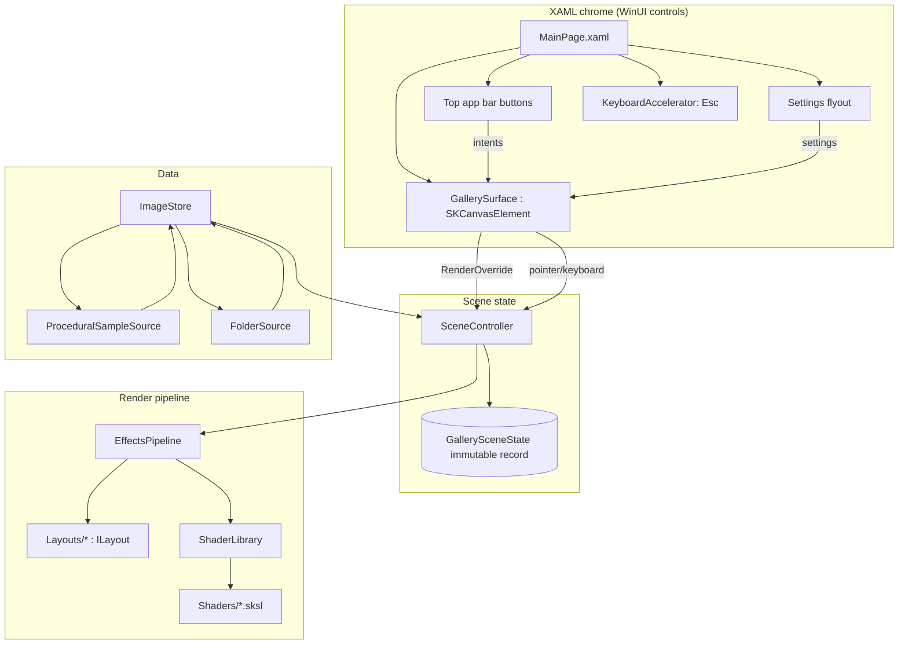
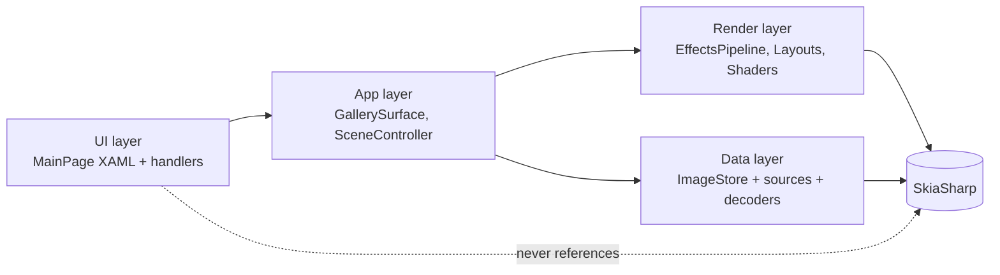
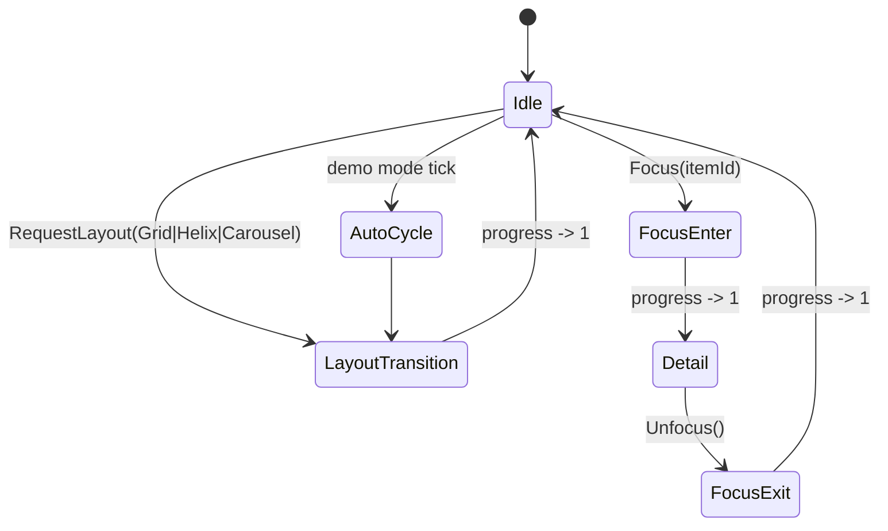
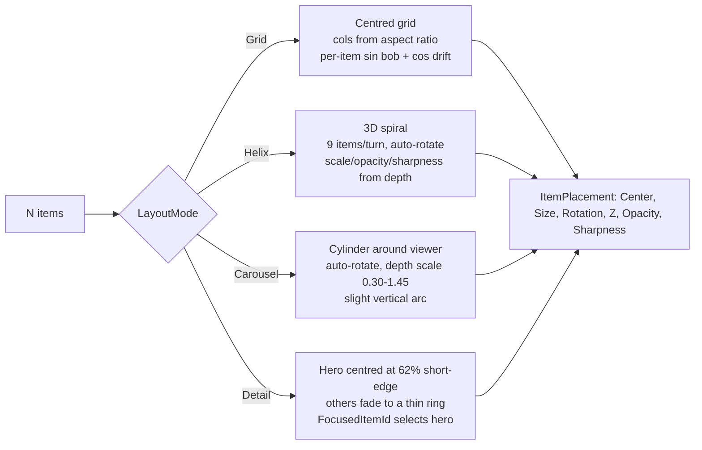
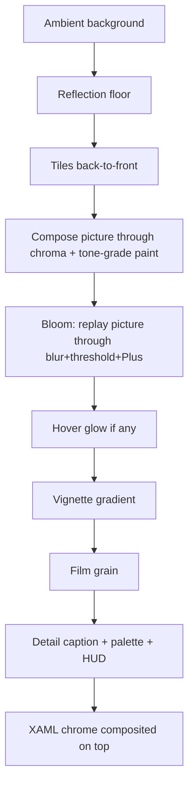
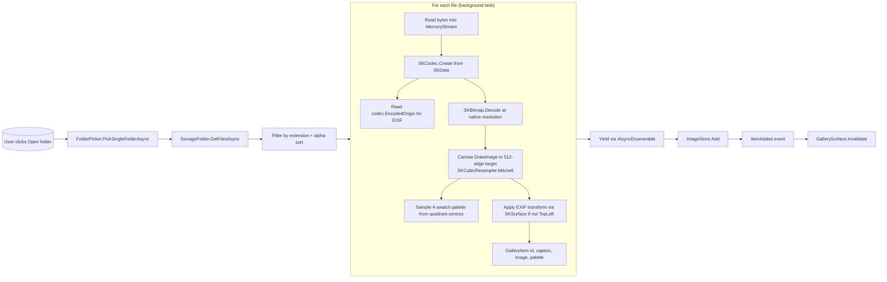
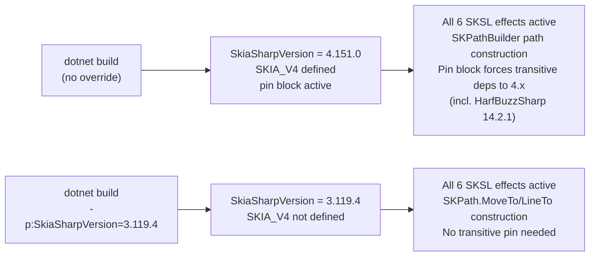

# UnoGallery — Design

A deliberately *gratuitous* image gallery built as a showcase for two things:

1. **Uno Platform** — one C#/XAML codebase that runs on Windows/macOS/Linux desktop, plus Android, iOS, and WebAssembly (in principle — only desktop is exercised regularly).
2. **SkiaSharp** — direct-GPU rendering via Uno's `SKCanvasElement`, programmable `SKRuntimeEffect` (SKSL) shaders, and the `SKImageFilter` / `SKPicture` pipeline. Six SKSL effects live in the default v3 build; a multi-version build property lets you opt in to SkiaSharp 4.

This document is a snapshot of the codebase as it actually ships, not a forward plan. Where reality diverged from the original blueprint — and there were several places — the notes call that out.

---

## 1. Vision

> *"Open a folder of photos. Watch them swarm into a wall, drift apart into a helix, fold into a carousel, dissolve from one arrangement to the next, iris into a single picture, all at 60 fps."*

What ships today:

- A canvas that renders directly into Uno's GPU compositor surface with zero bitmap-upload overhead.
- 30 procedurally-generated sample tiles for first-run, plus a folder picker that loads real photos via `SKCodec` (with EXIF orientation honoured).
- Four layout modes (Grid / Helix / Carousel / Detail) and three transition modes between them (eased lerp / SKSL dissolve / SKSL iris).
- Six SKSL effects live in the rendering pipeline (when on SkiaSharp v3) plus a SkiaSharp-4-compatible tone-grade color filter that works on both versions.
- Click-to-focus, Esc-to-dismiss, hover-glow, pointer-parallax. Demo-mode auto-cycle that pauses on user interaction.
- A settings flyout with 10 toggleable effects.

Non-goals:

- Editing, tagging, organising. Read-only viewer.
- HEIC support (SKCodec has no native plugin loaded; out of scope).
- Mobile / WASM target exercise. Builds resolve cleanly; render runtime is not regularly tested there.

---

## 2. Technical foundation

### 2.1 `SKCanvasElement` is an Uno API

The integration class we subclass to render Skia is `Uno.WinUI.Graphics2DSK.SKCanvasElement` — part of the Uno Platform, **not** SkiaSharp. It ships implicitly when `UnoFeatures` contains `SkiaRenderer`. The shape:

```csharp
public sealed class GallerySurface : Uno.WinUI.Graphics2DSK.SKCanvasElement
{
    protected override void RenderOverride(SKCanvas canvas, Windows.Foundation.Size area)
    {
        // Called when Uno needs to paint. canvas is backed by the same GPU
        // compositor surface used by the rest of the XAML tree.
    }
}
```

`Invalidate()` requests a repaint. For continuous animation we hook `Microsoft.UI.Xaml.Media.CompositionTarget.Rendering` and call `Invalidate()` per tick. The app uses both modes — continuous while anything's in flight, demand-based otherwise.

Compared to `SKXamlCanvas` (the older event-based API in `SkiaSharp.Views`), `SKCanvasElement`:

- Draws directly into the compositor surface instead of into a bitmap that's then uploaded.
- Receives sizes / coordinates in DIPs (device-independent pixels) — pointer math and rendering share one coordinate system.
- Composes natively with XAML transforms, opacity, clipping.

### 2.2 SkiaSharp: v4 by default, v3 still buildable

The original plan pinned SkiaSharp **4.147.0-preview.3.1**. Reality was messier:

- `SKRuntimeShaderBuilder` and any uniforms-bearing SKSL crashed on that preview — an `AccessViolation` inside native `sk_runtimeeffect_get_uniform_byte_size` on first frame.
- ABI risk: every Uno runtime DLL was compiled against 3.119.x and forced to bind to 4.x preview natives.
- The new API forms we *do* want (`SKPathBuilder`, `SKSamplingOptions`, `DrawImage(SKImage, SKRect, SKSamplingOptions)`) are also in 3.116+, so they don't justify the pin.

So for a long stretch the project defaulted to **3.119.4 stable**. That is no longer the case — **SkiaSharp 4.151.0 is the default** and the v3 line is the override:

```bash
dotnet build                                     # 4.151.0 stable (default)
dotnet build -p:SkiaSharpVersion=3.119.4         # older SkiaSharp 3 line
```

**What changed.** The AV was fixed somewhere between 4.147.0-preview.3.1 and 4.151.0. Establishing that took three passes, and the first two were dead ends worth recording:

1. A synthetic console probe (bare SkiaSharp, CPU raster surface, no Uno) with one `float` + one `float2` uniform — passed on *both* 4.147-preview and 4.151.0.
2. The same harness loading all seven real `.sksl` files with their real uniform signatures, including the `float3` in `HoverGlow` and the `uniform shader` children in `ChromaShift` / `Dissolve` / `Iris` — again passed on 4.147-preview, 4.151.0 *and* 3.119.4, with byte-identical centre pixels.

   Because the control never reproduced, neither probe could say anything about 4.151.0. The useful conclusion is negative: **this defect class is not reachable from a bare-SkiaSharp harness**, so don't try to regression-test it that way. It needed the Uno host.
3. Removing the `#if SKIA_V4` gate in `ShaderLibrary` and running the real app at 4.151.0 — all six effects compile, and temporary instrumentation confirmed `BackgroundPass` takes the SKSL plasma branch rather than the gradient fallback. (That check mattered: `TryCompileShader` swallows exceptions and returns null, so a failure would have silently degraded to the fallback and *looked* fine.)

The pin block's `HarfBuzzSharp` entries moved with the bump to **14.2.1** — what SkiaSharp 4.151.0 declares. The 4.147 previews wanted 8.3.1.6-preview.3.1; the two are unrelated version lines, so read the target `SkiaSharp.HarfBuzz` nuspec rather than comparing numbers.

`Directory.Build.props` defines `$(SkiaSharpVersion)` and conditionally adds `SKIA_V4` to `$(DefineConstants)`. `Directory.Packages.props` gates `CentralPackageTransitivePinningEnabled` and a 17-line transitive pin block behind `$(SkiaSharpVersion.StartsWith('4.'))` — v3 needs no pinning; Uno's runtime libs declare `SkiaSharp >= 3.119.0` which unifies cleanly. v4 needs the pin to drag `SkiaSharp.Views`, `NativeAssets.*`, and `HarfBuzzSharp.*` up off their 3.119 floors.

`SKIA_V4` now gates only genuinely version-specific APIs, not workarounds. `SKPathBuilder` was verified **absent from 3.119.4**, so the three sites that build paths keep a split:

1. `ProceduralSampleSource.DrawCurveFlow`
2. `MandalaTile` — samples the modulated arc into a `Span<SKPoint>` first, so only the points→path step differs.
3. `WireframeTile` — accumulates into eight depth-bucketed builders on v4, then snapshots into the `SKPath[]` the draw loop expects.

`SKSamplingOptions` and its `DrawImage` overloads exist on **both** lines, so `CurlNoiseTile` and `FolderSource` use them unconditionally — it's the paint/`FilterQuality` overloads that v4 obsoletes.

The `ShaderLibrary` gate is gone entirely: every effect loads on both versions. Consumers still null-check, so a future regression degrades to the non-SKSL fallbacks instead of crashing.

### 2.3 What we actually use from SkiaSharp

| Area | API | v3 (3.119.4) | v4.147-preview | v4 (4.151.0) |
|---|---|---|---|---|
| Procedural drawing | `SKShader`, `SKPaint`, gradients, `CreatePerlinNoiseTurbulence` | ✅ | ✅ | ✅ |
| Image decode | `SKCodec` → `SKBitmap.Decode(codec)` → canvas downscale | ✅ | ✅ | ✅ |
| Per-frame composition | `SKPictureRecorder` → `SKPicture` → `canvas.DrawPicture` | ✅ | ✅ | ✅ |
| Image filters | `SKImageFilter.CreateBlur`, `CreateDropShadowOnly` | ✅ | ✅ | ✅ |
| Color filters from SKSL | `SKRuntimeEffect.CreateColorFilter` + `ToColorFilter()` | ✅ | ✅ | ✅ |
| Shaders from SKSL with uniforms | `SKRuntimeEffect.CreateShader` + `ToShader(uniforms, children)` | ✅ | ❌ AV | ✅ |
| Picture as a shader child | `SKShader.CreatePicture(picture, ...)` | ✅ | ✅ | ✅ |
| Immutable path building | `SKPathBuilder` + `Snapshot()` | ❌ absent | ✅ | ✅ |
| Explicit sampling | `DrawImage(img, dest, SKSamplingOptions)` | ✅ | ✅ | ✅ |

The uniforms row was the killer for as long as the 4.147 preview was the v4 target: it worked on v3, crashed there, and cost five of the six effects. On 4.151.0 it works, which is what allowed the default to move to v4.

### 2.4 Targets & renderer

Build is single-project:

```
net10.0-android ; net10.0-ios ; net10.0-browserwasm ; net10.0-desktop
```

`<UnoFeatures>` includes `SkiaRenderer;` which makes `SKCanvasElement` viable on every TFM. WinAppSDK (native-renderer Windows) is out of scope — `SKCanvasElement` is Skia-renderer only. Windows users get the desktop Skia build.

---

## 3. UX walkthrough

### 3.1 Surfaces

| Where | What |
|---|---|
| **Top app bar** | Title, layout switcher (Grid/Helix/Carousel), Open folder…, Demo on/off, ⚙ settings flyout |
| **Settings flyout** | 10 toggles: Ambient bg / Bloom / Vignette / Grain / Chroma / Hover glow / Dissolve / Iris (each independently on/off) |
| **Canvas** | Full client area below the chrome bar. One `SKCanvasElement`, multi-layout, animated |
| **HUD chip** | Top-left of the canvas, shows current layout / transition target / progress |
| **Detail overlay** | Caption + 4-swatch palette + dismiss hint, painted on the canvas when a tile is focused |

### 3.2 First-run journey

```mermaid
journey
    title First-run path
    section Open
      Launch app: 5: User
      Procedural samples decode in: 5: User
      Demo mode auto-cycles Grid -> Helix -> Carousel: 5: User
    section Bring own photos
      Click Open folder...: 4: User
      Pick a directory of JPGs: 4: User
      Tiles stream in as decoded: 5: User
      Demo mode pauses; manual control: 4: User
    section Drill in
      Hover a tile: pulsing halo lifts it: 5: User
      Click: iris transition centred at tile, expanding into Detail: 5: User
      See caption + palette swatches: 4: User
      Esc / click anywhere: iris collapses back to where you clicked: 5: User
    section Switch layouts
      Click Helix: noise-dissolve to spiral: 5: User
      Click Carousel: dissolve to ring: 5: User
```

---

## 4. Architecture

### 4.1 Component diagram



### 4.2 Layering rules



The UI layer never touches SkiaSharp types. The render layer never touches XAML. They meet at exactly one place: `GallerySurface.RenderOverride` reads a snapshot of `GallerySceneState` from the controller. This keeps reasoning local — the renderer is unit-testable against a synthesised state, the XAML is unit-testable against the controller's public methods.

---

## 5. Per-frame rendering pipeline

A frame goes through one of three transition modes, chosen by the pipeline based on what's happening:

| Mode | When | What happens |
|---|---|---|
| **Default** | No transition, OR transition in progress with dissolve/iris disabled / unavailable | One scene render of (eased-lerped) placements, with bloom + hover-glow on top |
| **SKSL Dissolve** | Transition between non-Detail layouts, dissolve enabled, shader compiled | Two scene renders → SKSL noise-threshold blend |
| **SKSL Iris** | Transition involving Detail, iris enabled, shader compiled | Two scene renders → SKSL circular reveal anchored at the focused tile's position |

### 5.1 Default path

```mermaid
sequenceDiagram
    autonumber
    participant CT as CompositionTarget
    participant Surf as GallerySurface
    participant SC as SceneController
    participant EP as EffectsPipeline
    participant Lib as ShaderLibrary
    participant CV as SKCanvas

    CT->>Surf: Rendering tick
    Surf->>SC: Tick(seconds); Invalidate()
    Note over Surf: Uno schedules a paint
    Surf->>SC: Render(canvas, area)
    SC->>SC: Compute current placements (raw)
    SC->>SC: If TargetLayout: compute target placements (raw)
    SC->>EP: Render(canvas, size, state, current, target?)
    EP->>EP: target == null OR transition mode disabled
    EP->>EP: Lerp current+target if mid-transition
    EP->>EP: Record bg + reflection + tiles into SKPicture
    EP->>Lib: ToneGrade?, ChromaShift?
    EP->>CV: Draw picture through (chroma shader + tone-grade colour filter)
    EP->>CV: Bloom — replay picture through blur+threshold+Plus paint
    EP->>Lib: HoverGlow? (if hovered)
    EP->>CV: Pulsing halo around hovered tile (small rect, Plus blend)
    EP->>CV: Vignette gradient
    EP->>CV: Film grain perlin overlay
    EP->>CV: Detail overlay (caption+palette if focused) + HUD chip
```

Invariants:

- Tiles are sorted back-to-front by `Z` in a single in-place insertion sort before draw.
- Bloom and chroma both read from the SAME `SKPicture` — recorded once, replayed at most twice.
- Tone grade is a `SKColorFilter` so it composes naturally with the chroma shader on a single `SKPaint`.

### 5.2 Dissolve / Iris paths

```mermaid
sequenceDiagram
    autonumber
    participant SC as SceneController
    participant EP as EffectsPipeline
    participant Lib as ShaderLibrary
    participant CV as SKCanvas

    SC->>EP: Render(canvas, size, state, current, target)
    EP->>EP: Detail involved? -> Iris path. Otherwise -> Dissolve path.
    EP->>EP: Record picA (current placements -> bg+reflection+tiles)
    EP->>EP: Record picB (target placements -> bg+reflection+tiles)
    EP->>EP: SKShader.CreatePicture wrappers for both
    EP->>Lib: Dissolve or Iris runtime effect
    EP->>EP: Build SKRuntimeEffectUniforms + SKRuntimeEffectChildren
    EP->>CV: DrawRect with combined shader + tone-grade colour-filter paint
    EP->>CV: Vignette + grain on top
    Note over EP: Bloom + chroma + hover-glow skipped during transition<br/>(transitions are 0.9s; cost not worth two more passes)
```

For **Iris**, the centre of the reveal is the focused tile's position in the **non-Detail** layout (current for enter, target for exit). The shader computes the worst-case corner-distance from that centre and grows `progress * worstCase * 1.05` to fully cover. So the iris always lands exactly where the tile was, then envelops the whole screen.

For **Dissolve**, two octaves of value noise produce a per-pixel threshold; `smoothstep(n-feather, n+feather, progress)` gives a feathered crossfade band.

---

## 6. Scene state & transitions

`GallerySceneState` is the immutable record threaded through everything. The controller produces a new instance per change.

```csharp
public sealed record GallerySceneState(
    ImmutableArray<GalleryItem> Items,
    LayoutMode CurrentLayout,
    LayoutMode? TargetLayout,
    float TransitionProgress,    // 0..1, already eased
    int? FocusedItemId,
    int? HoveredItemId,
    Vector2 ViewerWorldPosition, // for parallax, normalised -1..1
    float WallClockSeconds,
    GallerySettings Settings);
```

### 6.1 Layout state machine



Transitions are *always* per-tile interpolation under the hood, even when the pipeline is rendering as SKSL dissolve/iris — those just pick which placement set to draw from. `TransitionProgress` is the eased fraction (InOutQuart, 0.9s duration).

### 6.2 Focus invariant (and the bug we fixed)

The trap: in the original `Unfocus()`, `FocusedItemId` was cleared *before* the dismiss transition started. The DetailLayout's "outgoing" frames had no hint, defaulted to `items[0]`, and the user saw the wrong picture animate back to the layout.

Fix: `Unfocus()` keeps `FocusedItemId` set; `Tick` clears it only when the dismiss transition completes (and only when leaving Detail). Same tile in, same tile out.

### 6.3 Demo mode

Auto-cycles `Grid → Helix → Carousel → Grid → …` every 5 s, skipping Detail entirely. Pauses for 3 s after any user interaction (hover, click, layout pick, settings toggle, folder load). Toggleable via the "Demo: on/off" button.

---

## 7. Layouts

Each layout is a pure function `(items, viewport, time, hint) → placements[]`. Adding one is a single file.



`DetailLayout` smuggles `FocusedItemId` through the `hoveredItemId` parameter of `ILayout.Compute` — `SceneController.Compute` forwards the right hint when the layout is `Detail`.

---

## 8. Effects catalog

Implementation status — all enabled by default unless noted.

| Effect | Mechanism | Location | Notes |
|---|---|---|---|
| **Bokeh blur** | `SKImageFilter.CreateBlur`, sigma from `(1 - Sharpness) * 6` | per-tile | Drives the depth/hover focus feel |
| **Drop shadow** | `SKImageFilter.CreateDropShadowOnly` | per-tile | Sells "floating photo" look |
| **Reflection floor** | Y-flipped tiles in a `SaveLayer` with linear-gradient `DstIn` mask | global | Floor line at 80 % of viewport height |
| **Ambient background** | SKSL `Ambient.Plasma` curl-noise + accent tint (v3) / dual radial gradient (v4) | global | Accent comes from focused/hovered tile palette |
| **Bloom** | `SKPicture` replay through `CreateBlur` + threshold colour matrix + Plus | global | Skipped during dissolve/iris transitions |
| **Tone grade** | SKSL `ToneGrade` colour filter | global | Split-tone shadows/highlights, sat bump, S-curve. Works on BOTH SkiaSharp versions (zero-uniforms ColorFilter path) |
| **Chromatic aberration** | SKSL `ChromaShift` shader, scene picture as child, modulated by transition progress | global | Subtle when settled, peaks mid-transition |
| **Vignette** | Radial gradient overlay | global | Gradient paint is visually equivalent to the SKSL version we have on disk; SKSL version retained for future use |
| **Film grain** | High-frequency Perlin turbulence + grey colour matrix + SoftLight | global | Seed rotates 60×/s for movie shimmer |
| **Hover glow** | SKSL `HoverGlow` shader with two-harmonic pulse, drawn over a small bounding rect | per-hover | Tinted by hovered tile's accent palette |
| **Dissolve transition** | SKSL `Dissolve` shader, two `SKPicture`s as iSrcA/iSrcB, noise-thresholded blend | transition | Active between Grid/Helix/Carousel |
| **Iris transition** | SKSL `Iris` shader, two `SKPicture`s, circular reveal anchored at focused-tile position | transition | Active for Detail enter/exit |

Effect order (default path):



---

## 9. SKSL shader library

Each SKSL source lives in `Shaders/*.sksl` as `EmbeddedResource`. `ShaderLibrary` compiles them once at first access and exposes nullable getters. Anything that uses uniforms is gated behind `#if !SKIA_V4`.

| File | Kind | Uniforms | Children | Version |
|---|---|---|---|---|
| `ToneGrade.sksl` | ColorFilter | (none) | (none) | both — parameterless `ToColorFilter()` |
| `Ambient.Plasma.sksl` | Shader | `iTime`, `iResolution`, `iAccent`, `iIntensity` | (none) | v3 only |
| `ChromaShift.sksl` | Shader | `iAmount`, `iResolution` | `iSrc` | v3 only |
| `HoverGlow.sksl` | Shader | `iCenter`, `iRadius`, `iColor`, `iTime` | (none) | v3 only |
| `Dissolve.sksl` | Shader | `iProgress`, `iNoiseScale` | `iSrcA`, `iSrcB` | v3 only |
| `Iris.sksl` | Shader | `iCenter`, `iResolution`, `iProgress` | `iSrcA`, `iSrcB` | v3 only |
| `Vignette.sksl` | Shader | `iResolution`, `iFalloff`, `iDarkness` | `iSrc` | unused — gradient paint is equivalent |

Loading is lazy and defensive. A compile failure or runtime exception in `ShaderLibrary` returns null; consumers null-check and fall back to a non-SKSL primitive.

---

## 10. Data layer

### 10.1 Sources

- **ProceduralSampleSource** generates 30 visually-distinct "photos" by drawing into 512×512 `SKImage`s at startup. Six generators cycle: linear gradient, radial burst, Julia fractal, voronoi cells, stripes, curve flow. Used as the first-run experience and as a working set when the user hasn't picked a folder.

- **FolderSource** loads from a `StorageFolder` picked through `Windows.Storage.Pickers.FolderPicker` (initialised with the app's window HWND on desktop). Reads supported extensions (.jpg/.jpeg/.png/.webp/.bmp/.gif), decodes each via `SKCodec`, honours EXIF orientation.

### 10.2 Decode pipeline



The "decode at native, downscale on canvas" structure is deliberate. The obvious `SKCodec.GetPixels(targetDimensions, buffer)` silently fails on JPEG when the requested dimensions don't match the format's supported integer scales (1/1, 1/2, 1/4, 1/8). Decoding native then resizing via canvas always works.

EXIF orientation is read from `SKCodec.EncodedOrigin`. Eight cases handled via `SKCanvas.Translate` + `Scale` + `RotateDegrees` combinations on a fresh `SKSurface`.

### 10.3 Store

`ImageStore` is a thread-safe `List<GalleryItem>` with two events:

- `ItemAdded` — fires per-yield so the gallery can re-layout as photos stream in.
- `Cleared` — fires when the store is reset (e.g. when a new folder is picked); also disposes all previous `SKImage` references.

No mip-chain LRU yet. With 512-px tiles, ~30 items is ~30 MB. Real photo sets in the hundreds would want an LRU — straightforward extension, not in scope today.

---

## 11. SkiaSharp version strategy



What's behind `#if SKIA_V4` in the codebase:
1. `ProceduralSampleSource.DrawCurveFlow` — `SKPathBuilder` (v4) vs `SKPath` mutable API (v3).
2. `ShaderLibrary` ctor — all uniforms-bearing shader loads.

Everything else is identical source. Future v4-only APIs (e.g. `SKRuntimeShaderBuilder` once the preview stabilises) go in next to similar guards.

---

## 12. File / folder structure

```
UnoGallery/
├── UnoGallery.sln
├── Directory.Build.props          ← SkiaSharpVersion property + SKIA_V4 define
├── Directory.Packages.props       ← v4 transitive pin block (conditional)
├── global.json                    ← Uno.Sdk pin
├── DESIGN.md                      ← this file
└── UnoGallery/
    ├── UnoGallery.csproj          ← UnoFeatures, AllowUnsafeBlocks, *.sksl EmbeddedResource glob
    ├── App.xaml(.cs)              ← Host setup, MainWindow exposed for picker
    ├── GlobalUsings.cs
    ├── appsettings.json
    ├── Presentation/
    │   ├── MainPage.xaml(.cs)     ← Chrome bar, settings flyout, KeyboardAccelerator for Esc
    │   └── MainModel.cs           ← MVUX scaffold (unused so far)
    ├── Models/
    │   ├── GalleryItem.cs
    │   ├── ItemPlacement.cs
    │   ├── LayoutMode.cs          ← Grid | Helix | Carousel | Detail
    │   ├── GallerySettings.cs     ← 10 EnableX flags + QualityTier
    │   └── GallerySceneState.cs   ← Immutable record threaded everywhere
    ├── Scene/
    │   ├── GallerySurface.cs      ← Uno.WinUI.Graphics2DSK.SKCanvasElement subclass
    │   ├── SceneController.cs     ← Owns state, Tick, transitions, demo mode
    │   └── Easing.cs              ← InOutQuart, OutCubic
    ├── Layouts/
    │   ├── ILayout.cs
    │   ├── GridLayout.cs
    │   ├── HelixLayout.cs
    │   ├── CarouselLayout.cs
    │   └── DetailLayout.cs
    ├── Effects/
    │   ├── EffectsPipeline.cs     ← Three-way dispatch (default / dissolve / iris)
    │   ├── BackgroundPass.cs      ← SKSL plasma or gradient fallback
    │   ├── ReflectionPass.cs
    │   ├── BloomPass.cs           ← SKPicture-replay bloom
    │   ├── VignettePass.cs        ← Radial gradient (SKSL version unused)
    │   └── FilmGrainPass.cs
    ├── Shaders/                   ← *.sksl as EmbeddedResource
    │   ├── ShaderLibrary.cs       ← Compile + null-on-failure
    │   ├── ToneGrade.sksl         ← Color filter (both versions)
    │   ├── Ambient.Plasma.sksl    ← Shader (v3 only)
    │   ├── ChromaShift.sksl       ← Shader with iSrc child (v3 only)
    │   ├── HoverGlow.sksl         ← Shader (v3 only)
    │   ├── Dissolve.sksl          ← Shader with iSrcA/iSrcB (v3 only)
    │   ├── Iris.sksl              ← Shader with iSrcA/iSrcB (v3 only)
    │   └── Vignette.sksl          ← Shader with iSrc child (unused)
    ├── Data/
    │   ├── IImageSource.cs
    │   ├── ImageStore.cs          ← Add / Clear / ItemAdded / Cleared
    │   ├── ProceduralSampleSource.cs
    │   └── FolderSource.cs        ← SKCodec decode + EXIF orientation
    └── Platforms/                 ← Per-TFM hosts (Desktop, Android, iOS, WebAssembly)
```

---

## 13. Performance

Per-frame budget at 60 fps (16.6 ms):

| Stage | Budget | Notes |
|---|---|---|
| Snapshot state | 0.2 ms | Immutable record copy |
| Compute placements (×1 or ×2) | 1.0 – 2.0 ms | Pure math; up to 200 items realistic |
| Sort by Z | 0.3 ms | Insertion sort, fine for N < 256 |
| Scene record (`SKPicture`) | 1.0 – 3.0 ms | Bg + reflection + tiles in display list |
| Compose (chroma + tone-grade paint) | 2.0 ms | One DrawRect or DrawPicture |
| Bloom replay | 2.0 ms | Blur radius 10, threshold matrix |
| Hover glow | 0.3 ms | Small rect only |
| Vignette + grain + overlays | 1.0 ms | All gradient/colour-filter primitives |
| Uno + XAML compositor overhead | 2.0 ms | Measured |
| Slack | ~3 ms | Don't eat it |

Transitions double-record (current + target), pushing the record step up to 4–6 ms — bloom + chroma + hover-glow are skipped during dissolve/iris specifically so the frame still fits.

If a target falls behind, the cuts in order are: bloom → grain → chroma → hover-glow → ambient-plasma-becomes-gradient → grain. `GallerySettings.QualityTier` is the hook (still wired to `High` everywhere; no auto-detect yet).

---

## 14. Risks & lessons learned

| What | What we learned |
|---|---|
| SkiaSharp 4 ABI risk | Hit a real native AV in `SKRuntimeShaderBuilder` / `SKRuntimeEffectUniforms..ctor` on first paint on 4.147.0-preview.3.1. Workaround at the time: default to v3.119.4, retain the v4 path for retest. The retest happened — fixed in 4.151.0, and v4 is now the default. Keeping a version switch is what made that a five-minute answer instead of an archaeology project. |
| `SKCanvasElement` ownership | The original DESIGN.md attributed `SKCanvasElement` to SkiaSharp; it's in `Uno.WinUI.Graphics2DSK`. Easy to confirm via `dotnet-ildasm`-style assembly inspection, painful to get wrong. |
| JPEG decode via `SKCodec.GetPixels` | Asking for arbitrary scaled dimensions silently fails on JPEG (only 1/N integer scales supported). Decode native, downscale via canvas. |
| Focus-bug class | Clearing transient state (FocusedItemId) before a transition starts breaks any consumer that reads it during the transition. Defer the clear until the transition completes. |
| Window-handle plumbing for pickers | `FolderPicker` needs an HWND on desktop. `WinRT.Interop.WindowNative` + `InitializeWithWindow` is the WinUI-standard route; works in Uno via the WinRT shims. Required exposing `App.MainWindow` as public. |
| `SKBitmap.Resize` cross-version | Signature shifted between 3.119 and 4.x (`SKFilterQuality` → `SKSamplingOptions`). Canvas-based downscale (`canvas.DrawImage(srcImg, dstRect, sampling)`) works on both. |
| Mermaid in design docs ages poorly | Diagrams in the original were aspirational. This rewrite is descriptive — what's there now. Updated together with code or it's worse than nothing. |

---

## 15. Where to start

| Question | File |
|---|---|
| Where does a frame get painted? | [Scene/GallerySurface.cs](../../Source/UnoGallery/UnoGallery/Scene/GallerySurface.cs) → `RenderOverride` |
| Where are scene mutations coordinated? | [Scene/SceneController.cs](../../Source/UnoGallery/UnoGallery/Scene/SceneController.cs) → `Tick`, `Focus`, `RequestLayout` |
| Where does layout X live? | [Layouts/<Mode>Layout.cs](../../Source/UnoGallery/UnoGallery/Layouts/) |
| Where do I add a new post-process effect? | [Effects/EffectsPipeline.cs](../../Source/UnoGallery/UnoGallery/Effects/EffectsPipeline.cs) — new `*Pass.cs` + new SKSL file + property on ShaderLibrary |
| Where does a chrome-button intent end up? | `Surface.SetLayout` / `Surface.Dismiss` / `Surface.UpdateSettings` → `SceneController` |
| Where are sample images? | [Data/ProceduralSampleSource.cs](../../Source/UnoGallery/UnoGallery/Data/ProceduralSampleSource.cs) |
| Where is the folder loader? | [Data/FolderSource.cs](../../Source/UnoGallery/UnoGallery/Data/FolderSource.cs) + `MainPage.OnOpenFolderClick` |
| Where are shaders? | [Shaders/*.sksl](../../Source/UnoGallery/UnoGallery/Shaders/) loaded by [Shaders/ShaderLibrary.cs](../../Source/UnoGallery/UnoGallery/Shaders/ShaderLibrary.cs) |
| Where is the SkiaSharp version switch? | [Directory.Build.props](../../Source/UnoGallery/Directory.Build.props) — `$(SkiaSharpVersion)` and the `SKIA_V4` define |
| Where's the v4 transitive pin? | [Directory.Packages.props](../../Source/UnoGallery/Directory.Packages.props) — only active when SkiaSharpVersion starts with "4." |

If any of those stop being true, this file has drifted — update it together with the code.
